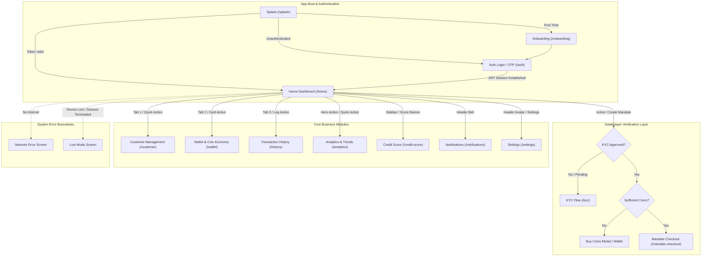
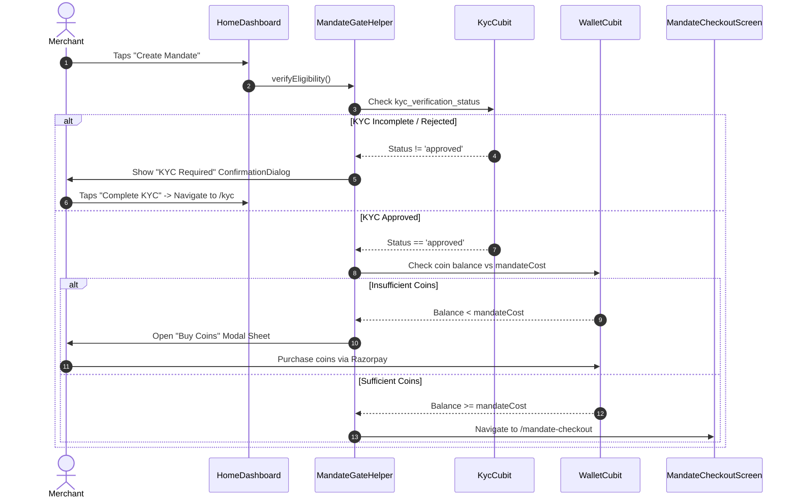

# FP Mandate Developer Docs Hub

> **[🏠 Root README](../README.md) • [🗺️ Architecture Flow](./project_architecture_and_flow.md) • [🎨 Design System](./theme_and_responsive_system.md) • [🚀 Open Interactive Portal](./index.html)**

> **Note:** These pages are specifically for **Developer Documentations**, containing technical guidelines, API flows, and architectural blueprints for the engineering team.

Welcome to the **FP Mandate Developer Docs Hub**. This directory provides an interconnected architectural blueprint, module specifications, and data flow guides for the entire cross-platform Flutter application.

---

## 🗺️ Master Application Architecture Map



---

## 📚 Master Module Matrix

Every module has a dedicated technical document detailing its domain flow, state controllers, API contracts, and UI components:

| #   | Module                 | Description                                                  | Primary Controller            | Entry Screen / Route           | Documentation Link                           |
| --- | ---------------------- | ------------------------------------------------------------ | ----------------------------- | ------------------------------ | -------------------------------------------- |
| 1   | **Splash**             | App initialization, token verification, session routing      | `SplashCubit`                 | `/splash`                      | [splash.md](./splash.md)                     |
| 2   | **Onboarding**         | First-time merchant walkthrough & value proposition          | `OnboardingCubit`             | `/onboarding`                  | [onboarding.md](./onboarding.md)             |
| 3   | **Authentication**     | Mobile OTP login, JWT management, secure refresh cycle       | `AuthBloc`                    | `/auth`                        | [auth.md](./auth.md)                         |
| 4   | **Home Dashboard**     | Merchant KPI summary, quick actions, gatekeeper triggers     | `HomeCubit`                   | `/home`                        | [home.md](./home.md)                         |
| 5   | **Mandate Checkout**   | Multi-step e-mandate wizard (Identity, Financing, Schedule)  | `MandateCheckoutCubit`        | `/mandate-checkout`            | [mandate_checkout.md](./mandate_checkout.md) |
| 6   | **Customer**           | Customer directory, mandate lists, detail views              | `CustomerCubit`               | `/customer`                    | [customer.md](./customer.md)                 |
| 7   | **Analytics**          | Cash flow velocity, comparative bar charts, status breakdown | `AnalyticsDataModel`          | `/analytics`                   | [analytics.md](./analytics.md)               |
| 8   | **Wallet**             | Virtual coin management, Razorpay payment top-up             | `WalletCubit`                 | `/wallet`                      | [wallet.md](./wallet.md)                     |
| 9   | **History**            | Historical transaction logs, filtering, export               | `HistoryCubit`                | `/history`                     | [history.md](./history.md)                   |
| 10  | **KYC**                | Merchant document upload, verification, QR handoff           | `KycCubit`                    | `/kyc`                         | [kyc.md](./kyc.md)                           |
| 11  | **Credit Score**       | SME credit score lookup, report download, coin deduction     | `CreditScoreCubit`            | `/credit-score`                | [credit_score.md](./credit_score.md)         |
| 12  | **Notifications**      | Push notification alerts, inbox management                   | `NotificationCubit`           | `/notifications`               | [notification.md](./notification.md)         |
| 13  | **Settings**           | Theme toggle, language selection, profile & security         | `SettingsCubit`, `ThemeCubit` | `/settings`                    | [settings.md](./settings.md)                 |
| 14  | **Refer & Earn**       | Merchant referral program, code sharing, coin rewards        | `ReferralBloc`                | `/referral`                    | [referral.md](./referral.md)                 |
| 15  | **Errors & Fallbacks** | Offline detection, maintenance mode, lost device mode        | Global Interceptor            | `/network-error`, `/lost-mode` | [errors.md](./errors.md)                     |

---

## 🛠️ Infrastructure & Cross-Cutting Systems

| System                                | Key Files & Location                      | Purpose                                                                                                   | Documentation Link                                                                                                                           |
| ------------------------------------- | ----------------------------------------- | --------------------------------------------------------------------------------------------------------- | -------------------------------------------------------------------------------------------------------------------------------------------- |
| **Design System & Responsive Engine** | `lib/core/theme/`, `lib/core/responsive/` | Self-contained tokens, theme presets, 1-line font switching, adaptive `.rw`, `.rh`, `.rsp`, `.rr` scaling | [theme_and_responsive_system.md](./theme_and_responsive_system.md)                                                                           |
| **Project Architecture & Flow**       | `developer_docs/project_architecture_and_flow.md`   | Master architecture overview, domain rules, and file organization                                         | [project_architecture_and_flow.md](./project_architecture_and_flow.md)                                                                       |
| **Razorpay Payment Integration**      | `developer_docs/razorpay_backend_guide.md`          | Coin checkout, order creation, signature verification, and webhook handling                               | [razorpay_backend_guide.md](./razorpay_backend_guide.md)                                                                                     |
| **Export Service**                    | `lib/core/services/export.service.dart`   | Universal cross-platform PDF generation, CSV encoding, field selection dialog                             | [project_architecture_and_flow.md#core-services--global-capabilities](./project_architecture_and_flow.md#core-services--global-capabilities) |
| **Dependency Injection**              | `lib/core/di/locator.dart`                | Centralized `GetIt` registry for all Blocs, Cubits, Services, and Repositories                            | [project_architecture_and_flow.md](./project_architecture_and_flow.md)                                                                       |
| **Network & Security**                | `lib/core/network/api.service.dart`       | Dio HTTP client with automatic JWT token refresh, talker logging, and retry logic                         | [auth.md](./auth.md)                                                                                                                         |

---

## 🔒 Security Gatekeepers Flow

FP Mandate protects high-value financial actions (e.g. creating an e-mandate) behind two sequential gatekeepers:



---

## 💻 Multi-Platform Parity Standards

- **Mobile (iOS & Android)**:
  - Responsive scaling powered by `flutter_screenutil`.
  - Native biometric authentication, camera scanner for QR code handoff, push notification handlers.
- **Desktop (macOS & Windows)**:
  - Unscaled logical pixels via `.rw`, `.rh`, `.rsp`, `.rr` extensions to avoid UI explosion on large monitors.
  - Split-screen layouts with visual illustrations on the left and form steppers on the right.
  - Native file picker and auto-saving to system `Documents/` directory via `ExportService`.
- **Web**:
  - Pure Flutter `foundation` checks (`kIsWeb`) preventing `dart:io` crashes.

---

## 🧪 Verification & Engineering Standards

All contributions to this workspace must adhere strictly to the engineering rules defined in [`.agents/rules.md`](../.agents/rules.md):

```bash
# 1. Generate code, assets, and translations
fvm dart run slang
fvm dart run build_runner build --delete-conflicting-outputs

# 2. Format code
dart format --output=none --set-exit-if-changed .

# 3. Static analysis checks (Zero-warning policy)
fvm flutter analyze --fatal-infos --fatal-warnings

# 4. Unit & Bloc test execution
fvm flutter test
```

---

### 🧭 Module Navigation

|       ⬅️ Previous Module        |        🏠 Documentation Hub         |                          ➡️ Next Module                           |
| :-----------------------------: | :---------------------------------: | :---------------------------------------------------------------: |
| [🏠 Project Root](../README.md) | **[📚 Connected Hub](./README.md)** | [Master Architecture Flow ➡️](./project_architecture_and_flow.md) |

- [Build & Release Guide](build_and_release.md) - Details on CI/CD, executables, and multiplatform configuration.
