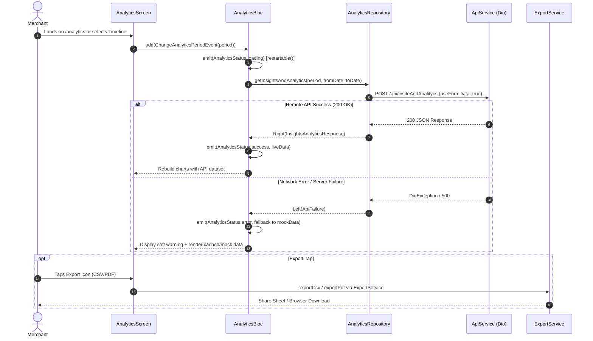

# Analytics Module Documentation

> **[🏠 Root README](../README.md) • [📚 Docs Hub](./README.md) • [🗺️ Architecture Flow](./project_architecture_and_flow.md) • [🚀 Open Interactive Portal](./index.html)**
> **Note:** These pages are specifically for **Developer Documentations**.


---

---

## 1. Overview & Business Context

- **Purpose:** Provides merchants and business owners with deep graphical insights into cash flow trends, mandate collection velocity, comparative debit realizations, and payment status distributions. Eliminates banking and algorithmic jargon by translating complex metrics into clear, human-friendly financial insights.
- **Access Boundaries:**
  - Authenticated merchants only (`AuthAuthenticated`).
  - Read-only analytics reporting; export privileges governed by active subscription and session state.
- **Supported Platforms:**
  - Android, iOS, macOS, Windows, Linux, and Web via `ResponsiveLayout`.
  - Responsive layout dynamically adapts breakpoints: Mobile (`< 650px`), Tablet (`650px - 1100px`), Desktop (`>= 1100px`).

---

---

## 2. End-to-End Module Flow & State Lifecycle

### 2.1 User Journey & Step-by-Step UI Flow

1. **Entry Trigger:**
   - Merchant taps "View Detailed Analytics ➔" on the Home Dashboard collection hero card.
   - Merchant selects the "Analytics & Trends" quick action card.
   - Direct deep link or drawer navigation to route `AppRoutes.analytics` (`/analytics`, Tab Index: 6).
2. **Action / Interaction Steps:**
   - **Timeline Selection:** Merchant switches timeframe via the horizontal filter pills:
     - `Last 7 Days` (`thisWeek`)
     - `This Month` (`thisMonth`)
     - `Last 3 Months` (`threeMonths`)
     - `Last 6 Months` (`sixMonths`)
     - `This Year` (`thisYear`)
     - `Lifetime` (`allTime`)
     - `Custom Dates` (`custom`): Triggers native/modal `showDateRangePicker` dialog.
   - **Metric Filtering:** Merchant taps metric pills (`All`, `Collected`, `Expected`, `Failed`) to filter the interactive line chart series.
   - **Interactive Chart Inspection:** Touch/hover over Bézier curve datapoints displays a localized floating tooltip showing date, amount, and debit count.
   - **Report Export:** Tapping the export icon opens the format selection modal (CSV / PDF) powered by `ExportService`.
3. **Async / Background Processing:**
   - Screen initializes `AnalyticsCubit.fetchData()`.
   - Displays animated gold shimmer/loaders or retains stale data while background re-fetching takes place.
4. **Outcome Branches:**
   - **Happy Path:** Live API payload (`InsightsAnalyticsResponse`) parsed into domain structures and charts render with animated ease-in curves.
   - **Failure / Offline Fallback:** If remote API encounters network failure or non-200 responses, the repository yields an `ApiFailure`. The Cubit logs the warning and gracefully falls back to deterministic local historical mock models (`AnalyticsPeriodData.getMockData(...)`) ensuring zero screen crashes.
5. **Exit / Terminal Route:** Merchant navigates back to Home (`context.pop()` or fallback `context.go('/common-screen')`).

### 2.2 Architectural Sequence / Flow Diagram



---

---

## 3. Architecture & Code Structure

### 3.1 File Layout

```dart
lib/modules/analytics/
├── analytics.dart                          # Module Public API Surface (Barrel File)
├── controllers/
│   ├── analytics.bloc.dart                 # Business Logic Controller
│   ├── analytics.event.dart                # Sealed Event Classes
│   └── analytics.state.dart                # Sealed State & Status Enums
├── data/
│   └── analytics.repository.dart           # Non-throwing Functional Repository Boundary
├── models/
│   ├── analytics.model.dart                # TimelinePeriod, MetricFilter, UI DataPoint models
│   └── insights_analytics_response.model.dart # Remote DTOs (DataPoints, Comparison, Breakdown)
├── screens/
│   └── analytics.screen.dart               # Responsive Analytics Dashboard Scaffold & Views
└── widgets/
    ├── analytics_charts.widget.dart        # InteractiveAreaLineChart, ComparativeBarChart, DistributionDoughnutChart
    ├── analytics_kpi_grid.widget.dart      # AnalyticsKpiGridWidget & AnalyticsKpiCardWidget
    ├── analytics_metric_filter_bar.widget.dart # AnalyticsMetricFilterBarWidget
    ├── analytics_section_card.widget.dart  # AnalyticsSectionCardWidget
    └── analytics_timeline_selector.widget.dart # AnalyticsTimelineSelectorWidget
```

### 3.2 Barrel File Encapsulation Contract (`analytics.dart`)

Only public entry points are exposed:

- `AnalyticsBloc`, `AnalyticsEvent`, & `AnalyticsState`
- Public domain models: `TimelinePeriod`, `MetricFilter`, `InsightsAnalyticsResponse`
- Entry screen: `AnalyticsScreen`
Internal feature widgets (`analytics_charts.widget.dart`) and `AnalyticsRepository` remain private to the module.

### 3.3 Core Dependencies & DI Registration

- **Service Locator:** Injected via `lib/core/di/locator.dart`.
  - `AnalyticsRepository`: Registered as `lazySingleton<AnalyticsRepository>()`.
  - `AnalyticsBloc`: Registered as `factory<AnalyticsBloc>()`.
- **Infrastructure:** Injected `ApiService` with automatic bearer token attachment.

---

---

## 4. State Management (BLoC / Cubit)

- **Controller Name:** `AnalyticsBloc` (`Bloc<AnalyticsEvent, AnalyticsState>`).
- **Concurrency Transformers:**
  - `restartable()`: Applied to `FetchAnalyticsEvent`, `ChangeAnalyticsPeriodEvent`, and `SetAnalyticsCustomRangeEvent` so new timeline switches cancel pending network requests.
  - `droppable()`: Applied to `ExportAnalyticsEvent` to ignore duplicate export taps while report generation is in progress.
- **States & Equatable Props:**

  ```dart
  enum AnalyticsStatus { initial, loading, success, error }

  class AnalyticsState extends Equatable {
    final AnalyticsStatus status;
    final TimelinePeriod selectedPeriod;
    final String? fromDate;
    final String? toDate;
    final InsightsAnalyticsResponse? response;
    final String? errorMessage;
    
    bool get hasData => response?.data != null;
    
    @override
    List<Object?> get props => [
      status,
      selectedPeriod,
      fromDate,
      toDate,
      response,
      errorMessage,
    ];
  }
  ```

- **Concurrency & Event Handlers:**
  - `fetchData()`: Triggers API call; safely dispatches loading and success/error states.
  - `changePeriod(TimelinePeriod)`: Resets custom date bounds if switching to a fixed preset and re-fetches.
  - `setCustomRange(DateTime, DateTime)`: Formats dates to `yyyy-MM-dd` and invokes `changePeriod(TimelinePeriod.custom)`.

---

---

## 5. API & Data Layer Contracts

### 5.1 Endpoints Map

- Endpoint constant: `ProfileApi.insightsAndAnalytics` (`lib/core/routes/apis/endpoints/profile.api.endpoints.dart`).
- Full URI: `${Api.baseUrlNew}${Api.api}insiteAndAnalitycs`.
- Method: `POST`.
- Protocol: `multipart/form-data` (`useFormData: true`).

### 5.2 Request Payload

| Field       | Type     | Description                                                                                        |
| ---

----------- | -------- | -------------------------------------------------------------------------------------------------- |
| `period`    | `String` | `'thisWeek'`, `'thisMonth'`, `'threeMonths'`, `'sixMonths'`, `'thisYear'`, `'allTime'`, `'custom'` |
| `from_date` | `String` | `'YYYY-MM-DD'` (required if `period == 'custom'`, else `""`)                                       |
| `to_date`   | `String` | `'YYYY-MM-DD'` (required if `period == 'custom'`, else `""`)                                       |

### 5.3 Repository Contract & Guarantee

```dart
TaskEither<ApiFailure, InsightsAnalyticsResponse> getInsightsAndAnalytics(
  final TimelinePeriod period, {
  final String fromDate = '',
  final String toDate = '',
});
```

- **Zero-Throwing Guarantee:** `AnalyticsRepository` handles transport errors, network socket drops, and format exceptions internally, returning `TaskEither.left(ApiFailure)`.

---

---

## 6. UI, Design Tokens & Mandatory Assets

### 6.1 Design Tokens & Dynamic Palette Switch (`lib/core/theme/`)

- **Design Tokens:** All screen layout elements, charts, KPI cards, and filter bars strictly import design system tokens from `lib/core/theme/theme.dart` as defined in the [Theme & Responsive System User Manual](./theme_and_responsive_system.md).
- **Semantic Colors (`context.colors`):** Colors adapt dynamically via `context.colors` (`context.colors.card`, `context.colors.textPrimary`, `context.colors.cardBorder`, `context.colors.success`, `context.colors.error`), supporting light/dark theme switching and dynamic SASS brand skinning via `AppThemeConfig` (`goldLuxury`, `fintechBlue`, `emerald`, `corporateIndigo`).
- **Typography & Layout Tokens:** Typography referenced strictly from `AppTextStyles` (`headline1`, `subtitle1`, `body1`, `caption`), spacing via `AppSpacing.*Responsive` or `context.screenPadding`, radii via `AppBorderRadius.*Responsive`, and shadows via `AppShadows.card(isDark: context.isDark)`.
- **Responsive Clamping:** Clamped scaling via `.rw`, `.rh`, `.rsp`, `.rr` preventing oversized artifacts on 1440p/4K monitors.

### 6.2 Plain-Language Jargon Translation Matrix

| Technical / Banking Jargon | User-Friendly Term                  | Where It Appears                     |
| ---

-------------------------- | ----------------------------------- | ------------------------------------ |
| **Realized Volume**        | **Money Collected** / **Collected** | KPI Grid, Chart Legends, Metrics Bar |
| **Upcoming Debits**        | **Upcoming Payments**               | Distribution Ring Chart Legend       |
| **Bounced / Default**      | **Failed Payments** / **Failed**    | KPI Grid, Comparative Bar Chart      |
| **Total Pipeline**         | **Total Expected**                  | KPI Card 3, Metric Filter            |
| **Portfolio Velocity**     | **Collection Velocity**             | Main Bézier Curve Area Chart         |
| **Realized vs Bounced**    | **Collected vs Failed Payments**    | Periodic Bar Chart                   |

### 6.3 Core Component Reuse

- `PrimaryButton` and `CustomSnackbar` from `lib/core/widgets/`.
- Tabular download modals reuse `ExportSelectionDialog`.

---

---

## 7. Multi-Platform & Error Handling Strategy

- **Desktop (macOS / Windows / Linux):**
  - Tooltips dynamically react to mouse hover states without requiring touch gestures.
  - Sizing constraints clamp max content width to prevent horizontal stretching.
- **Web Discipline:**
  - Date picker and export downloads use conditional browser-compatible APIs.
  - Zero imports from `dart:io`.
- **Failure Matrix:**
| Failure Scenario       | Internal Failure Code     | User-Facing Action                                   |
| ---

---------------------- | ------------------------- | ---------------------------------------------------- |
| Network Socket Timeout | `ApiFailure.network`      | Soft notification + Cached/Mock Trend data displayed |
| Invalid Date Range     | `ApiFailure.badRequest`   | Error snackbar: prompts user to re-pick range        |
| Session Expiration     | `ApiFailure.unauthorized` | Token interceptor refreshes or redirects to Login    |

---

---

## 8. Verification & Test Suite

Unit and Cubit test suite resides under `test/modules/analytics/`:

```bash
# Execute analytics test suite
fvm flutter test test/modules/analytics/
```

- **BLoC Tests (`analytics.cubit_test.dart`):** Verifies state transitions `[loading, success]` and fallback `[loading, error]` across all timeline presets.
- **Repository Tests (`analytics.repository_test.dart`):** Validates form-data construction, period enum mapping, and `TaskEither` failure absorption using `mocktail`.
- **Static Analysis Gate:** Enforces 0 warnings via `fvm flutter analyze --fatal-infos --fatal-warnings`.

## 9. Quality Enforcement
- Koi bhi feature PR / commit tab tak pass nahi mana jayega jab tak uske flow diagrams aur step-by-step user journey documentation `docs/developer_docs/[feature_name].md` me update na ho chuki ho.
