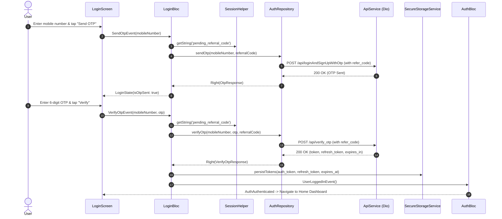

# Authentication Module Documentation

> **[🏠 Root README](../README.md) • [📚 Docs Hub](./README.md) • [🗺️ Architecture Flow](./project_architecture_and_flow.md) • [🚀 Open Interactive Portal](./index.html)**
> **Note:** These pages are specifically for **Developer Documentations**.

---

---

## 1. Overview & Business Context

- **Purpose:** Manages user authentication, session security, OTP dispatch/verification, and preemptive JWT token lifecycle. Provides high-security access control for merchant and agent operations across mobile and web.
- **Access Boundaries:** Public gateway. Grants access to authenticated application states upon successful OTP verification.
- **Supported Platforms:** Mobile (Android, iOS), Desktop (macOS, Windows, Linux), and Web via responsive split-screen layouts.

---

---

## 2. End-to-End Module Flow & State Lifecycle

### 2.1 User Journey & Step-by-Step UI Flow

1. **Entry Trigger:** User opens the application without an active session or after session revocation/expiration. Routed to `AppRoutes.login` (`/login`).
2. **Action / Interaction Steps:**
   - **Mobile Entry:** User inputs mobile number with country-adaptive maximum length constraints (10 digits for `+91` / `+1`, 11 for `+44`, up to 15 for international dial codes) and numeric keypad (`TextInputType.number`). Dynamic placeholder hints guide format entry (`e.g. 9876543210`).
   - **Keyboard Occlusion Guard:** The slogan and branding footer (`BrandFooterWidget`) reactively hide when the software keyboard is active (`MediaQuery.of(context).viewInsets.bottom == 0`), preventing visual distortion or overlapping of form action buttons.
   - **Referral Code Injection:** Users referred via Deep Links automatically have their code read from `SessionHelper`. Alternatively, a premium animated "Have a Referral Code?" button (powered by `flutter_animate`) triggers an adaptive form (BottomSheet on mobile, Dialog on desktop) allowing users to manually apply a code prior to sending OTP. The input strictly enforces uppercase formatting via `UpperCaseTextFormatter`.
   - **Send OTP:** User clicks "Send OTP". UI transitions smoothly via `AnimatedSwitcher` to the OTP verification screen with active 60-second resend countdown.
   - **OTP Verification:** User types or auto-fills the 6-digit OTP into `Pinput`.
   - **Legal Agreement Access:** Explicit links and drawer options route to `AppRoutes.policyAgreement` (`PolicyAgreementScreen`), dynamically serving Privacy Policy and Terms of Service documents.
   - **Link Code Access:** Optional direct device linking flow for multi-device authorization.
3. **Async / Background Processing:**
   - Dispatches `SendOtpEvent` or `VerifyOtpEvent` to `LoginBloc`.
   - `LoginBloc` fetches `pending_referral_code` from the session.
   - UI shows non-blocking shimmers or progress indicator on primary action button.
4. **Outcome Branches:**
   - **Happy Path:** OTP verified successfully. Short-lived JWT (`auth_token`), long-lived `refresh_token`, and calculated expiry saved into `SecureStorageService`. `AuthBloc` transitions to `AuthAuthenticated` and user is routed to Home Dashboard.
   - **Failure / Error Path:** Invalid OTP or network interruption yields `ApiFailure`. A glassmorphic `CustomSnackbar` displays localized error message (`t.auth.enter_otp_error` or server message).
5. **Exit / Terminal Route:** Navigates to `/` (Home Dashboard) upon successful authentication.

### 2.2 Architectural Sequence / Flow Diagram

---

---

## 3. Architecture & Code Structure

- **File Layout:**
  - `controllers/`:
    - `login/login.bloc.dart`, `login.event.dart`, `login.state.dart`
    - `policy/policy.cubit.dart`, `policy.state.dart`
  - `data/`:
    - `auth.repository.dart`: Non-throwing repository returning `TaskEither<ApiFailure, T>`
    - `policy.repository.dart`: T&C content repository
  - `models/`: DTOs (`login_response.model.dart`, `policy.model.dart`)
  - `screens/`:
    - `login.screen.dart`: Main entry screen with responsive layout switches
    - `policy_agreement.screen.dart`: Standalone Terms & Conditions screen
  - `widgets/`:
    - `login_mobile_layout.widget.dart`, `login_desktop_layout.widget.dart`
    - `login_form_content.widget.dart`, `login_form.widget.dart`, `otp_form.widget.dart`
    - `auth_form_header.widget.dart`, `login_header.widget.dart`
- **Core Dependencies:** Injected via `lib/core/di/locator.dart` (`ApiService`, `SecureStorageService`, `AuthService`, `KycHandoffService`). The `PolicyAgreementScreen` integrates `lib/core/widgets/loading_overlay.widget.dart` (which strictly uses `StackFit.expand` to prevent RenderFlex overflows when dealing with dynamic HTML content).

---

---

## 4. State Management (BLoC / Cubit)

- **Controller Name:** `LoginBloc`, `PolicyCubit`.
- **Events:** Sealed class hierarchy (`SendOtpEvent`, `VerifyOtpEvent`, `ResetLoginStateEvent`).
- **States:** Immutable `LoginState` with `status` enum (`initial`, `loading`, `success`, `failure`), `errorMessage`, and complete `props` implementation.
- **Transformers & Concurrency:** Concurrency managed via event transformers to avoid duplicate OTP request spamming.

---

---

## 5. API & Data Layer Contracts

- **Endpoints:**
  - `POST /api/loginAndSignUpWithOtp`: Single endpoint for login/signup OTP request.
  - `POST /api/verify_otp`: Verifies OTP and returns access & refresh tokens.
  - `POST /api/refresh-token`: Rotates access token via isolated `refreshDio` in `JwtInterceptor`.
  - **Dynamic Legal Document Retrieval (`Api.getPolicyUrl`)**: The URLs for `Privacy Policy` and `Terms & Conditions` are constructed dynamically inside `lib/core/routes/apis/api.endpoints.dart`. This ensures robust `https` fallback and avoids UI-side URL string coupling.
- **Repository Interface & Implementation:**
  - `AuthRepository`: Methods return non-throwing `TaskEither<ApiFailure, T>`.
  - `PolicyRepository`: Fetches and parses document HTML from dynamic external links.

---

---

## 6. UI, Design Tokens & Mandatory Assets

- **Asset Registry:** Generated assets accessed strictly via `Assets.images.*` (`lib/gen/assets.gen.dart`).
- **Core Widget Reusability:** Standardized on `PrimaryButton`, `CustomTextField`, `ConfirmationDialog`, and `CustomSnackbar`.
- **Design Tokens & Theme Palette Switch (`lib/core/theme/`):** All authentication layouts and sub-widgets strictly import design system tokens from `lib/core/theme/theme.dart` as defined in the [Theme & Responsive System User Manual](./theme_and_responsive_system.md). All UI components bind colors dynamically via `context.colors` (`context.colors.card`, `context.colors.textPrimary`, `context.colors.cardBorder`, `context.colors.primary`), typography via `AppTextStyles`, spacing via `AppSpacing.*Responsive` or `context.screenPadding`, radii via `AppBorderRadius.*Responsive`, and shadows via `AppShadows.card(isDark: context.isDark)`. This guarantees dynamic palette skinning across SASS brand presets (`goldLuxury`, `fintechBlue`, `emerald`, `corporateIndigo`) via `AppThemeConfig` and automatic light/dark mode adaptation without hardcoded color overrides.
- **Localization:** 100% Slang integration (`t.auth.*`).

---

---

## 7. Multi-Platform & Error Handling Strategy

- **Platform Handling:**
  - Mobile: Fullscreen scrollable card with native touch interactions and OTP autofill.
  - Desktop / Web: Split-view with brand visual on the left and elevated glassmorphic form card on the right; Enter key submissions.
- **Failure Matrix:** Network disconnects, 401s, and malformed OTP inputs mapped cleanly to user-friendly notifications.

---

---

## 8. Verification & Test Suite

- Unit and BLoC tests in `test/modules/auth/`:
  - `login_bloc_test.dart`: Verifies state transitions across `SendOtpEvent` and `VerifyOtpEvent`.
  - Mocktail-based data layer tests for `AuthRepository`.

---

---

### 🧭 Module Navigation

|              ⬅️ Previous Module              |        🏠 Documentation Hub         |             ➡️ Next Module             |
| :---

------------------------------------------: | :---------------------------------: | :------------------------------------: |
| [⬅️ Onboarding Walkthrough](./onboarding.md) | **[📚 Connected Hub](./README.md)** | [Home Dashboard & Gates ➡️](./home.md) |

## 9. Quality Enforcement
- Koi bhi feature PR / commit tab tak pass nahi mana jayega jab tak uske flow diagrams aur step-by-step user journey documentation `docs/developer_docs/[feature_name].md` me update na ho chuki ho.
