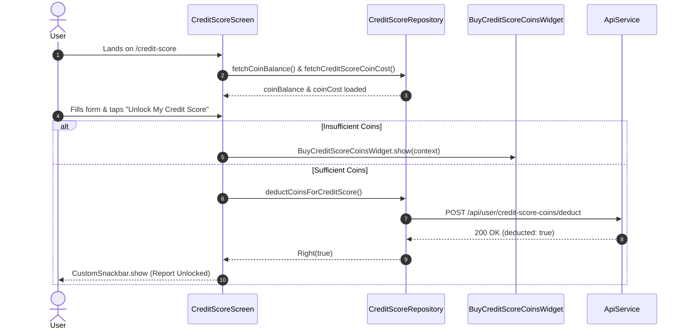

# Credit Score Module Documentation

> **[🏠 Root README](../README.md) • [📚 Docs Hub](./README.md) • [🗺️ Architecture Flow](./project_architecture_and_flow.md) • [🚀 Open Interactive Portal](./index.html)**
> **Note:** These pages are specifically for **Developer Documentations**.

---

---

## 1. Overview & Business Context

- **Purpose:** Enables users to evaluate and verify their comprehensive creditworthiness and bureau standing directly within the application. Acts as a high-conversion financial utility feature upselling platform coins and premium mandate capabilities.
- **Access Boundaries:** Authenticated users. Access to credit score unlock is gated by platform coin balance or dynamic token pricing.
- **Supported Platforms:** Mobile (Android, iOS), Desktop (macOS, Windows, Linux), and Web via responsive glassmorphic layouts.

---

---

## 2. End-to-End Module Flow & State Lifecycle

### 2.1 User Journey & Step-by-Step UI Flow

1. **Entry Trigger:** User taps "Check Credit Score" on the Home Dashboard quick action grid or from Settings navigation.
2. **Action / Interaction Steps:**
   - **Profile Input:** User enters full name (as on PAN card), 10-character PAN number, mobile number, and email address.
   - **Coin Verification:** Screen displays user's current coin balance in the top app bar and calculates required coin cost.
   - **Unlock Score:** User taps "Unlock My Credit Score".
3. **Async / Background Processing:**
   - Form validation executes on all fields (regex validation for PAN and Email).
   - If balance is insufficient, opens `BuyCreditScoreCoinsWidget` bottom sheet modal.
   - If balance is sufficient, triggers `repository.deductCoinsForCreditScore()`.
4. **Outcome Branches:**
   - **Happy Path:** Coins deducted, UI notifies user of credit score compilation, and transitions to report view.
   - **Failure / Edge Case Path:** Network failure or insufficient balance prompts retry or instant coin purchase flow.
5. **Exit / Terminal Route:** Returns to previous dashboard or opens detailed credit analysis.

### 2.2 Architectural Sequence / Flow Diagram

---

---

## 3. Architecture & Code Structure

- **File Layout:**
  - `screens/`: `credit_score.screen.dart`: Primary user input screen with glowing blur ambient backgrounds and reactive coin status.
  - `widgets/`: `credit_score_components.widget.dart`: Reusable glassmorphic input fields (`CreditScoreGlassTextField`) and action button (`CreditScoreSubmitButton`).
  - `data/`: `credit_score.repository.dart` (registered in `lib/core/di/locator.dart`).
- **Core Dependencies:** Injected via `locator<CreditScoreRepository>()`.

---

---

## 4. State Management (BLoC / Cubit)

- **Controller Strategy:** Screen lifecycle state managed cleanly with scoped reactive state, form keys, and DI-injected non-throwing repository calls.
- **Form State:** Strict real-time regex validators for PAN, Mobile, and Email with full Slang error key localization.

---

---

## 5. API & Data Layer Contracts

- **Endpoints:**
  - `GET /api/user/credit-score-coins`: Returns available coin balance.
  - `GET /api/config/credit-score-cost`: Returns current unlock cost in coins.
  - `POST /api/user/credit-score-coins/deduct`: Deducts cost from user account.
- **Repository Interface & Implementation:** Standardized non-throwing contracts using `TaskEither<ApiFailure, T>`.

---

---

## 6. UI, Design Tokens & Mandatory Assets

- **Asset Registry:** Uses generated icon sets and vector assets via `Assets.*`.
- **Core Widget Reusability:** Employs `CustomAppBar`, `CustomTextField`, `CustomSnackbar`, and `AnimatedfpmandateLoaderWidget`.
- **Design Tokens & Theme Palette Switch (`lib/core/theme/`):** All screen elements and sub-widgets strictly import design system tokens from `lib/core/theme/theme.dart` as defined in the [Theme & Responsive System User Manual](./theme_and_responsive_system.md). All UI components bind colors dynamically via `context.colors` (`context.colors.card`, `context.colors.textPrimary`, `context.colors.cardBorder`, `context.colors.primary`), typography via `AppTextStyles`, spacing via `AppSpacing.*Responsive` or `context.screenPadding`, radii via `AppBorderRadius.*Responsive`, and shadows via `AppShadows.card(isDark: context.isDark)`. This guarantees dynamic palette skinning across SASS brand presets (`goldLuxury`, `fintechBlue`, `emerald`, `corporateIndigo`) via `AppThemeConfig` and automatic light/dark mode adaptation without hardcoded color overrides.
- **Localization:** All copy localized via `t.credit_score.*`.

---

---

## 7. Multi-Platform & Error Handling Strategy

- **Platform Handling:** Responsive layouts adapt smoothly from phone displays to expanded tablet and desktop screens with soft ambient gradient blurs.
- **Failure Matrix:** Network disconnects and validation failures display semantic snackbars without interrupting form input.

---

---

## 8. Verification & Test Suite

- Unit test suite located at `test/modules/credit_score/`:
  - Validates PAN and email validation rules.
  - Verifies non-throwing behavior of `CreditScoreRepository`.

---

---

### 🧭 Module Navigation

|             ⬅️ Previous Module              |        🏠 Documentation Hub         |            ➡️ Next Module             |
| :---

-----------------------------------------: | :---------------------------------: | :-----------------------------------: |
| [⬅️ Customer CRM & Mandates](./customer.md) | **[📚 Connected Hub](./README.md)** | [Wallet & Settlement ➡️](./wallet.md) |

## 9. Quality Enforcement
- Koi bhi feature PR / commit tab tak pass nahi mana jayega jab tak uske flow diagrams aur step-by-step user journey documentation `docs/developer_docs/[feature_name].md` me update na ho chuki ho.
