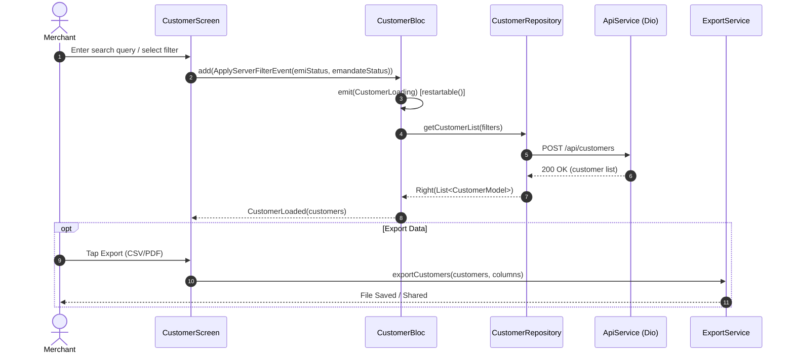

# Customer Module Documentation

> **[🏠 Root README](../README.md) • [📚 Docs Hub](./README.md) • [🗺️ Architecture Flow](./project_architecture_and_flow.md) • [🚀 Open Interactive Portal](./index.html)**
> **Note:** These pages are specifically for **Developer Documentations**.

---

---

## 1. Overview & Business Context

- **Purpose:** Allows merchants and agents to add, view, filter, and manage their end-customers. Serves as the core CRM hub of the application for setting up new digital mandates and monitoring EMI payment milestones.
- **Access Boundaries:** Authenticated merchants and agents with valid JWT sessions.
- **Supported Platforms:** Mobile (Android, iOS), Desktop (macOS, Windows, Linux), and Web via `ResponsiveLayout`.

---

---

## 2. End-to-End Module Flow & State Lifecycle

### 2.1 User Journey & Step-by-Step UI Flow

1. **Entry Trigger:** User navigates to Customers via bottom navigation tab or home quick action tile.
2. **Action / Interaction Steps:**
   - **Cross-Module Smart Filters:** If routed from another module (e.g., Home Dashboard's Recent Activity), `_handleInitialFilters` automatically unwraps nested router payloads to extract smart filters (`name`, `emiStatus`, `emandateStatus`), pre-fills the search controller, and immediately dispatches `ApplyServerFilterEvent` for seamless context transfer.
   - **Search & Filter:** User types into search bar to filter by name/mobile, or toggles filter pills (All, EMI Status, E-Mandate Status) with animated expandable sub-chips.
   - **Customer Selection:** User taps a customer card to open detailed profile information where sensitive credentials (registration numbers, bank accounts, phones) are rendered via `SelectableText` for convenient long-press copying.
   - **Export Records:** User initiates CSV/PDF generation with column selection through `ExportService`.
3. **Async / Background Processing:**
   - Dispatches search or filter events to `CustomerBloc`.
   - UI displays non-intrusive loaders or updates cached lists smoothly without screen re-scrolling.
4. **Outcome Branches:**
   - **Happy Path:** Filtered list of customers rendered with responsive tiles/cards.
   - **Empty / Error Path:** Localized empty states ("No customers found") or offline snackbar.
5. **Exit / Terminal Route:** Opens `CustomerDetailsScreen` or returns to Home.

### 2.2 Architectural Sequence / Flow Diagram

---

---

## 3. Architecture & Code Structure

- **File Layout:**
  - `controllers/`: `customer.bloc.dart`, `customer.event.dart`, `customer.state.dart`
  - `data/`: `customer.repository.dart`
  - `models/`: `customer.list.request.model.dart`, `customer.model.dart`
  - `screens/`: `customer.screen.dart`, `customer.details.screen.dart`
  - `widgets/`:
    - `customer.content.widget.dart`, `customer.date.filter.widget.dart`, `customer.empty.state.widget.dart`, `customer.stat.widget.dart`
    - `search/`: `customer.search.bar.widget.dart`, `customer.search.bar.filter.widget.dart`, `customer.search.bar.chips.widget.dart`
    - `list/`: `desktop.customer.list.widget.dart`, `mobile.customer.list.widget.dart`, `mobile.customer.card.widget.dart`
    - `details/`: `customer.details.mobile.layout.widget.dart`, `customer.details.desktop.layout.widget.dart`, `premium.profile.header.widget.dart`, `premium.loan.dashboard.widget.dart`, `premium.emi.schedule.widget.dart`
- **Core Dependencies:** Injected via `locator<CustomerRepository>()`, `locator<ExportService>()`.

---

---

## 4. State Management (BLoC / Cubit)

- **Controller Name:** `CustomerBloc`.
- **Concurrency Transformers:**
  - `restartable()`: Applied to `ApplyServerFilterEvent` and `SearchCustomersEvent` to cancel pending HTTP fetches when new search queries/filters are triggered.
  - `droppable()`: Applied to `ExportCustomerListEvent` to prevent duplicate concurrent export triggers.
- **States:** Sealed state classes (`CustomerInitial`, `CustomerLoading`, `CustomerLoaded`, `CustomerError`).
- **Transformers & Concurrency:** Search uses debounced inputs. Filter changes actively preserve filter selections across network updates.

---

---

## 5. API & Data Layer Contracts

- **Endpoints:**
  - `POST /api/customers`: Fetches customer list. Accepts complex filter payloads.
  - `POST /api/customers/add`: Registers a new customer profile.
  - `GET /api/emandate/emi-frequencies`: Fetches mandate frequencies.
- **Filter Parameters Contract (`CustomerListRequest`):**
  - `search`: String (searches against name or mobile).
  - `emi_status`: Enum string (`''` for all, `'upcoming'`, `'overdue'`, `'paid'`).
  - `emandate_status`: Enum string (`''` for all, `'active'`, `'failed'`).
  - `date_filter`: Enum string (`'none'`, `'today'`, `'yesterday'`, `'this_week'`, `'this_month'`, `'custom'`).
  - `from_date` / `to_date`: `YYYY-MM-DD` formatted dates (required only when `date_filter` is `'custom'`).
- **Repository Interface & Implementation:** Returns typed, non-throwing `TaskEither<ApiFailure, List<CustomerModel>>`.

---

---

## 6. UI, Design Tokens & Mandatory Assets

- **Asset Registry:** Accesses generated icon assets via `Assets.*`.
- **Core Widget Reusability:** Standardized on `RootScaffold`, `CustomAppBar`, `CustomTextField`, `ExportSelectionDialog`, and crucially **`DesktopDataTable`** for unified desktop grid layouts (replacing legacy manual responsive tables).
- **Design Tokens & Theme Palette Switch (`lib/core/theme/`):** All screen elements and sub-widgets strictly import design system tokens from `lib/core/theme/theme.dart` as defined in the [Theme & Responsive System User Manual](./theme_and_responsive_system.md). All UI components bind colors dynamically via `context.colors` (`context.colors.card`, `context.colors.textPrimary`, `context.colors.cardBorder`, `context.colors.primary`), typography via `AppTextStyles`, spacing via `AppSpacing.*Responsive` or `context.screenPadding`, radii via `AppBorderRadius.*Responsive`, and shadows via `AppShadows.card(isDark: context.isDark)`. This guarantees dynamic palette skinning across SASS brand presets (`goldLuxury`, `fintechBlue`, `emerald`, `corporateIndigo`) via `AppThemeConfig` and automatic light/dark mode adaptation without hardcoded color overrides.
- **Responsive Scaling:** Responsive extensions (`.rw`, `.rh`, `.rsp`, `.rr`) and `AppSpacing` prevent UI distortion on high-DPI desktop screens.
- **UI Sub-components:** Zero helper methods returning widgets; all chips isolated in private `StatelessWidget` sub-components (`_CustomerCategoryChipWidget`, `_CustomerSubChipWidget`).

---

---

## 7. Multi-Platform & Error Handling Strategy

- **Platform Handling:**
  - Mobile: Native touch interactions, swipeable lists, direct dial/SMS shortcuts.
  - Desktop / Web: High-density data tables, hover highlights, direct file saving via `ExportService`.
- **Failure Matrix:** Network and parsing errors mapped to localized feedback.

---

---

## 8. Verification & Test Suite

- Unit test suite at `test/modules/customer/`:
  - Validates `CustomerCubit` filter transitions.
  - Mocks `CustomerRepository` responses for offline resilience.

---

---

### 🧭 Module Navigation

|              ⬅️ Previous Module              |        🏠 Documentation Hub         |                 ➡️ Next Module                  |
| :---

------------------------------------------: | :---------------------------------: | :---------------------------------------------: |
| [⬅️ Mandate Checkout](./mandate_checkout.md) | **[📚 Connected Hub](./README.md)** | [Credit Score Assessment ➡️](./credit_score.md) |

## 9. Quality Enforcement
- Koi bhi feature PR / commit tab tak pass nahi mana jayega jab tak uske flow diagrams aur step-by-step user journey documentation `docs/developer_docs/[feature_name].md` me update na ho chuki ho.
