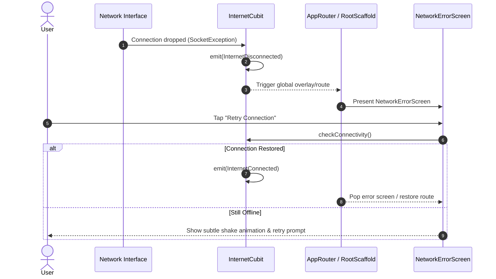

# Errors & App Fallback Module Documentation

> **[🏠 Root README](../README.md) • [📚 Docs Hub](./README.md) • [🗺️ Architecture Flow](./project_architecture_and_flow.md) • [🚀 Open Interactive Portal](./index.html)**
> **Note:** These pages are specifically for **Developer Documentations**.

---

---

## 1. Overview & Business Context

- **Purpose:** Manages catastrophic app-level fallback states, including complete connectivity loss, fatal initialization errors, mandatory app updates, and lost/compromised terminal modes.
- **Access Boundaries:** Globally accessible. Bypasses standard authentication guards to display recovery states.
- **Supported Platforms:** Mobile (Android, iOS), Desktop (macOS, Windows, Linux), and Web.

---

---

## 2. End-to-End Module Flow & State Lifecycle

### 2.1 User Journey & Step-by-Step UI Flow

1. **Entry Trigger:** Network disconnection detected by `InternetCubit`, or unrecoverable fatal application error.
2. **Action / Interaction Steps:** User views full-bleed animated error state with retry action button.
3. **Async / Background Processing:** `InternetCubit` continuously probes active connectivity streams.
4. **Outcome Branches:**
   - **Happy Path (Recovery):** Network connection restored; UI seamlessly dismisses error screen and restores previous navigation stack.
   - **Persistent Failure:** User remains on error overlay with manual "Retry Connection" capability.
5. **Exit / Terminal Route:** Returns to the screen active prior to interruption.

### 2.2 Architectural Sequence / Flow Diagram

---

---

## 3. Architecture & Code Structure

- **File Layout:**
  - `screens/`: `network.screen.dart`, `lostmode.screen.dart`
  - Root module barrel: `errors.dart`
- **Core Dependencies:** Listens to `InternetCubit` and `UpdateService`.

---

---

## 4. State Management (BLoC / Cubit)

- **Controller Name:** Driven by global `InternetCubit` and `ThemeCubit`.
- **States:** Reactive stream subscription without redundant localized screen controllers.

---

---

## 5. API & Data Layer Contracts

- **Endpoints:** Direct connectivity ping via `InternetAddress.lookup()` (or Web equivalent).
- **Repository Interface & Implementation:** Purely transport-level detection.

---

---

## 6. UI, Design Tokens & Mandatory Assets

- **Asset Registry:** Uses high-resolution SVG graphics from `Assets.images.*`.
- **Core Widget Reusability:** Standardized on `PrimaryButton` and `RootScaffold`.
- **Design Tokens & Theme Palette Switch (`lib/core/theme/`):** All error fallback screens strictly import design system tokens from `lib/core/theme/theme.dart` as defined in the [Theme & Responsive System User Manual](./theme_and_responsive_system.md). All UI components bind colors dynamically via `context.colors` (`context.colors.card`, `context.colors.textPrimary`, `context.colors.error`, `context.colors.primary`), typography via `AppTextStyles`, spacing via `AppSpacing.*Responsive` or `context.screenPadding`, radii via `AppBorderRadius.*Responsive`, and shadows via `AppShadows.card(isDark: context.isDark)`. This guarantees dynamic palette skinning across SASS brand presets (`goldLuxury`, `fintechBlue`, `emerald`, `corporateIndigo`) via `AppThemeConfig` and automatic light/dark mode adaptation without hardcoded color overrides.

---

---

## 7. Multi-Platform & Error Handling Strategy

- **Platform Handling:** Prevents unwanted desktop window scaling while in error mode; ensures touch-friendly target sizes on mobile.
- **Failure Matrix:** Distinguishes between transient offline states and permanent server maintenance.

---

---

## 8. Verification & Test Suite

- Unit & widget test coverage under `test/modules/errors/`.

---

---

### 🧭 Module Navigation

|             ⬅️ Previous Module             |        🏠 Documentation Hub         |                       ➡️ Next Module                       |
| :---

----------------------------------------: | :---------------------------------: | :--------------------------------------------------------: |
| [⬅️ Settings & Preferences](./settings.md) | **[📚 Connected Hub](./README.md)** | [Architecture Flow ➡️](./project_architecture_and_flow.md) |

## 9. Quality Enforcement
- Koi bhi feature PR / commit tab tak pass nahi mana jayega jab tak uske flow diagrams aur step-by-step user journey documentation `docs/developer_docs/[feature_name].md` me update na ho chuki ho.
