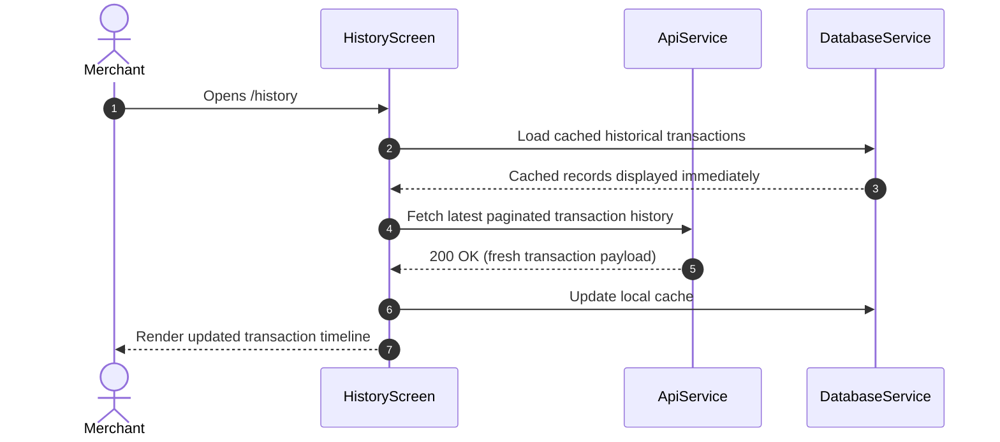

# History & Audit Trail Module Documentation

> **[🏠 Root README](../README.md) • [📚 Docs Hub](./README.md) • [🗺️ Architecture Flow](./project_architecture_and_flow.md) • [🚀 Open Interactive Portal](./index.html)**
> **Note:** These pages are specifically for **Developer Documentations**.

---

---

## 1. Overview & Business Context

- **Purpose:** Provides merchants and business operators with a comprehensive chronological audit ledger of digital mandate debit events, settlements, and customer transaction records.
- **Access Boundaries:** Authenticated users with active session (`AuthAuthenticated`).
- **Supported Platforms:** Mobile (Android, iOS), Desktop (macOS, Windows, Linux), and Web via responsive data grids.

---

---

## 2. End-to-End Module Flow & State Lifecycle

### 2.1 User Journey & Step-by-Step UI Flow

1. **Entry Trigger:** User selects the "History" tab from bottom navigation or clicks "Recent Activity" on Home Dashboard.
2. **Action / Interaction Steps:** User navigates paginated transaction records, applies date or status filters, and clicks an item to view receipt details.
3. **Async / Background Processing:** UI fetches paginated transaction lists and presents responsive shimmers during load.
4. **Outcome Branches:**
   - **Happy Path:** Chronological ledger renders with debit status badges (Success, Pending, Failed).
   - **Failure / Empty State:** Displays localized empty ledger illustration or offline banner.
5. **Exit / Terminal Route:** Returns to dashboard or details screen.

### 2.2 Architectural Sequence / Flow Diagram

---

---

## 3. Architecture & Code Structure

- **File Layout:**
  - `screens/`: `history.screen.dart`
  - Module public surface: `history.dart`
- **Core Dependencies:** Injected `ApiService`, `DatabaseService`, and `ExportService`.

---

---

## 4. State Management (BLoC / Cubit)

- **Controller Strategy:** Standardized reactive state management with sealed states and pagination guards.

---

---

## 5. API & Data Layer Contracts

- **Endpoints:** `/api/transaction-history`, `/api/mandate-history`.
- **Repository Interface & Implementation:** Non-throwing contracts returning `TaskEither<ApiFailure, T>`.

---

---

## 6. UI, Design Tokens & Mandatory Assets

- **Asset Registry:** Uses status badges and transaction icons via `Assets.*`.
- **Core Widget Reusability:** Standardized on `RootScaffold`, `CustomAppBar`, `AnimatedfpmandateLoaderWidget`, and `ExportSelectionDialog`.
- **Design Tokens & Theme Palette Switch (`lib/core/theme/`):** All screen elements and sub-widgets strictly import design system tokens from `lib/core/theme/theme.dart` as defined in the [Theme & Responsive System User Manual](./theme_and_responsive_system.md). All UI components bind colors dynamically via `context.colors` (`context.colors.card`, `context.colors.textPrimary`, `context.colors.cardBorder`, `context.colors.primary`), typography via `AppTextStyles`, spacing via `AppSpacing.*Responsive` or `context.screenPadding`, radii via `AppBorderRadius.*Responsive`, and shadows via `AppShadows.card(isDark: context.isDark)`. This guarantees dynamic palette skinning across SASS brand presets (`goldLuxury`, `fintechBlue`, `emerald`, `corporateIndigo`) via `AppThemeConfig` and automatic light/dark mode adaptation without hardcoded color overrides.

---

---

## 7. Multi-Platform & Error Handling Strategy

- **Platform Handling:** Mobile uses infinite vertical list with swipe actions; Desktop utilizes wide multi-column data tables with horizontal scroll bars.
- **Failure Matrix:** Network disconnects fall back to local cached SQLite transaction ledger.

---

---

## 8. Verification & Test Suite

- Unit and widget test coverage under `test/modules/history/`.

---

---

### 🧭 Module Navigation

|                 ⬅️ Previous Module                 |        🏠 Documentation Hub         |                     ➡️ Next Module                     |
| :---

------------------------------------------------: | :---------------------------------: | :----------------------------------------------------: |
| [⬅️ Analytics, Reports & Insights](./analytics.md) | **[📚 Connected Hub](./README.md)** | [Credit Score & Risk Assessment ➡️](./credit_score.md) |

## 9. Quality Enforcement
- Koi bhi feature PR / commit tab tak pass nahi mana jayega jab tak uske flow diagrams aur step-by-step user journey documentation `docs/developer_docs/[feature_name].md` me update na ho chuki ho.
