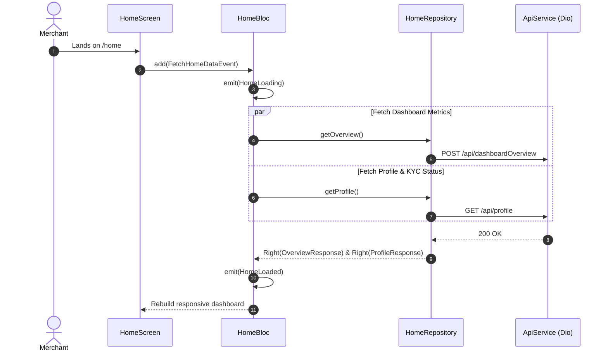

# Home Dashboard Module Documentation

> **[🏠 Root README](../README.md) • [📚 Docs Hub](./README.md) • [🗺️ Architecture Flow](./project_architecture_and_flow.md) • [🚀 Open Interactive Portal](./index.html)**
> **Note:** These pages are specifically for **Developer Documentations**.

---

---

## 1. Overview & Business Context

- **Purpose:** Central operational dashboard for merchants. Synthesizes business health, digital collection velocity, mandate bounce rates, top defaulters, and real-time KYC compliance gates.
- **Access Boundaries:** Authenticated users (`AuthAuthenticated`).
- **Supported Platforms:** Mobile, Tablet, Desktop, and Web via `ResponsiveLayout`.

---

---

## 2. End-to-End Module Flow & State Lifecycle

### 2.1 User Journey & Step-by-Step UI Flow

1. **Entry Trigger:** User completes authentication or opens app with valid session. Routed to `/home`.
2. **Action / Interaction Steps:**
   - User views KPI hero card (total digital cash collected, success rate).
   - User interacts with collection trend bar chart (inspects High, Low, Current volume).
   - User checks mandate health grid and reviews top defaulting customer accounts.
   - User taps quick action cards (Check Credit Score, Create Mandate, View Analytics).
   - User taps a **Recent Activity** tile. The dashboard extracts the customer's raw name from the activity description, evaluates the `emiStatus` and `emandateStatus` from the context, and routes to the Customer Screen with these smart filters pre-applied via `initialFilters`.
3. **Async / Background Processing:**
   - `HomeBloc.add(FetchHomeDataEvent())` requests dashboard overview, summaries, and profile status.
   - Upon successful fetch, `HomeBloc` globally syncs the user profile to `locator<UserInfoService>()` (a `ChangeNotifier`).
   - Background re-fetch updates charts without UI jitter.
4. **Outcome Branches:**
   - **Happy Path:** Live financial metrics render with animated easing curves.
   - **KYC Incomplete:** Warning banner prompts user to resume multi-step onboarding.
5. **Exit / Terminal Route:** Navigates to selected feature module via `context.push()`.

### 2.2 Architectural Sequence / Flow Diagram

---

---

## 3. Architecture & Code Structure

- **File Layout:**
  - `cubit/`: `home.cubit.dart`, `home.state.dart`
  - `data/`: `home.repository.dart`
  - `models/`: `dashboard_summary_response.model.dart`, `overview_response.model.dart`, `profile_response.model.dart`
  - `screens/`: `home.screen.dart`
  - `widgets/`:
    - `digital_collection_hero.widget.dart`, `mandate_health_grid.widget.dart`
    - `trend_chart.widget.dart`, `home_kyc_banner.widget.dart`
    - `home_desktop_body.widget.dart`, `home_mobile_body.widget.dart`
    - `quick_action_card.widget.dart`, `top_defaulters.widget.dart`
- **Core Dependencies:** Injected via `locator<HomeRepository>()`.

---

---

## 4. State Management (BLoC / Cubit) & Compliance Evaluation

- **Controller Name:** `HomeCubit` / `HomeBloc`.
- **States:** Sealed hierarchy (`HomeInitial`, `HomeLoading`, `HomeLoaded`, `HomeError`).
- **KYC Status Evaluation:** Reusable compliance evaluation handled via `KycStatusEvaluation.fromKycData(...)` (`lib/core/helpers/kyc_status.helper.dart`), ensuring consistent banner rendering across home layouts.
- **Transformers & Concurrency:** Concurrency managed cleanly with debounce guards on manual swipe-to-refresh.

---

---

## 5. API & Data Layer Contracts

- **Endpoints:**
  - `GET /api/profile`: User personal and business verification state.
  - `POST /api/dashboardOverview`: Aggregated digital collection totals.
  - `POST /api/dashboardSummary`: Timeframe-filtered trend records.
- **Repository Interface & Implementation:** Standardized non-throwing contracts using `TaskEither<ApiFailure, T>`.

---

---

## 6. UI, Design Tokens & Mandatory Assets

- **Asset Registry:** Accesses generated brand icons and card backgrounds via `Assets.*`.
- **Core Widget Reusability:** Standardized on `RootScaffold`, `CustomAppBar`, and `AnimatedfpmandateLoaderWidget`.
- **Design Tokens & Theme Palette Switch (`lib/core/theme/`):** All home dashboard sub-widgets strictly import design system tokens from `lib/core/theme/theme.dart` as defined in the [Theme & Responsive System User Manual](./theme_and_responsive_system.md). All UI components bind colors dynamically via `context.colors` (`context.colors.card`, `context.colors.textPrimary`, `context.colors.cardBorder`, `context.colors.primary`), typography via `AppTextStyles`, spacing via `AppSpacing.*Responsive` or `context.screenPadding`, radii via `AppBorderRadius.*Responsive`, and shadows via `AppShadows.card(isDark: context.isDark)`. This guarantees dynamic palette skinning across SASS brand presets (`goldLuxury`, `fintechBlue`, `emerald`, `corporateIndigo`) via `AppThemeConfig` and automatic light/dark mode adaptation without hardcoded color overrides.
- **UI Sub-components:** Zero helper methods returning widgets; all chart micro-indicators decomposed into dedicated `StatelessWidget` sub-components (`_TrendInsightWidget`).

---

---

## 7. Multi-Platform & Error Handling Strategy

- **Platform Handling:** Mobile uses single-column card cascade with pull-to-refresh; Desktop / Web uses multi-column dashboard grid with collapsible sidebar.
- **Failure Matrix:** Network drops retain stale data while displaying non-blocking retry indicator.

---

---

## 8. Verification & Test Suite

- Unit test suite at `test/modules/home/`.

---

---

### 🧭 Module Navigation

|       ⬅️ Previous Module       |        🏠 Documentation Hub         |              ➡️ Next Module              |
| :---

----------------------------: | :---------------------------------: | :--------------------------------------: |
| [⬅️ Authentication](./auth.md) | **[📚 Connected Hub](./README.md)** | [KYC Verification Pipeline ➡️](./kyc.md) |

## 9. Quality Enforcement
- Koi bhi feature PR / commit tab tak pass nahi mana jayega jab tak uske flow diagrams aur step-by-step user journey documentation `docs/developer_docs/[feature_name].md` me update na ho chuki ho.
