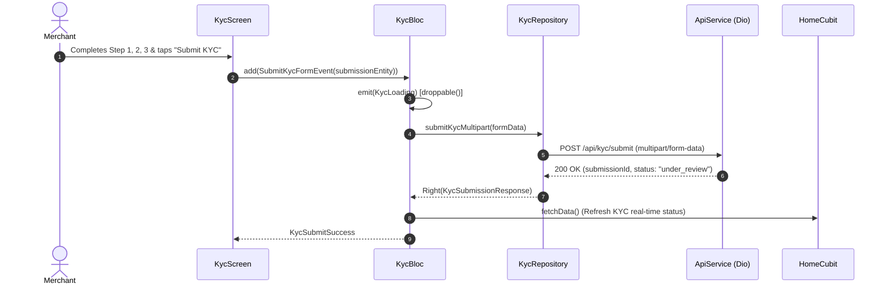

# KYC Verification Pipeline Module Documentation

> **[🏠 Root README](../README.md) • [📚 Docs Hub](./README.md) • [🗺️ Architecture Flow](./project_architecture_and_flow.md) • [🚀 Open Interactive Portal](./index.html)**
> **Note:** These pages are specifically for **Developer Documentations**.

---

---

## 1. Overview & Business Context

- **Purpose:** Governs the compliant onboarding and identity verification of merchants (NPCI/RBI regulatory standards). Manages a multi-step document collection wizard, live camera capture, and desktop continuity handoff.
- **Access Boundaries:** Authenticated users. Full mandate creation remains gated until KYC status reaches verified (`kyc_verification_status == 2`).
- **Supported Platforms:** Mobile (native camera and gallery picker), Desktop / Web (Continuity handoff via mobile QR code sync).

---

---

## 2. End-to-End Module Flow & State Lifecycle

### 2.1 User Journey & Step-by-Step UI Flow

1. **Entry Trigger:** User clicks "Complete KYC" on Home banner or is routed from settings.
2. **Action / Interaction Steps:**
   - **Step 1 (Personal Details):** Full name, phone number, and verified Email address (validated with strict email RFC regex `^[\w-\.]+@([\w-]+\.)+[\w-]{2,4}$` and user hints).
   - **Step 2 (Business & Entity Details):** Organization category, trade/entity name, PAN card (strictly 10 uppercase alphanumeric chars `^[A-Z]{5}[0-9]{4}[A-Z]{1}$`), GST, and business document uploads. Handled `"I don't have a business"` exemption and avoided redundant document requests when PAN card is selected.
   - **Step 3 (Bank Account Verification & Referral):** Bank name, account holder name, account number (9 to 18 numeric digits), strict IFSC code (11 uppercase alphanumeric chars `^[A-Z]{4}0[A-Z0-9]{6}$`), canceled cheque image, and optional Distributor Referral Code (auto-filled from deep link).
   - **Desktop Handoff (Optional):** Desktop users can scan an on-screen QR code to complete camera verification on their phone.
3. **Async / Background Processing:** Form submission is strictly executed on final submission button click. Intermediate dropdown selection drafts are bypassed to eliminate premature 422 ("Required field missing") validation popups.
4. **Outcome Branches:**
   - **Happy Path:** Document package submitted and verified by backend (`KycSubmitSuccess`). Success screen and celebratory confetti trigger strictly upon confirmed backend response.
   - **Rejection / Resubmit:** Specific rejection reasons highlighted with inline document replacement controls and field-level feedback.
5. **Exit / Terminal Route:** Navigates back to Home Dashboard with updated verification banner.

### 2.2 Architectural Sequence / Flow Diagram

---

---

## 3. Architecture & Code Structure

- **File Layout:**
  - `controllers/`: `kyc.bloc.dart`, `kyc.event.dart`, `kyc.state.dart`
  - `data/`:
    - `kyc.repository.dart`, `kyc.datasource.dart`
    - `models/kyc.model.dart`: Contains `CategoryModel`, `OrganizationModel`, and `KycSubmissionEntity`.
  - `handoff/`: `controllers/`, `models/`, `screens/`, `widgets/` (Desktop QR pairing)
  - `screens/`: `kyc.screen.dart`
  - `widgets/`:
    - `kyc_intro.widget.dart`, `kyc_step1.widget.dart`, `kyc_step2.widget.dart`
    - `kyc_step3.widget.dart`, `kyc_success_step.widget.dart`, `kyc_components.widget.dart`
- **Core Dependencies:** Injected via `locator<KycRepository>()`, `locator<KycHandoffService>()`.

---

---

## 4. State Management (BLoC / Cubit) & Status Evaluation

- **Controller Name:** `KycBloc` (with `KycHandoffCubit` for short-lived QR pairing).
- **Strongly Typed Form Models & Dropdowns:**
  - Organization and Document dropdowns utilize generic type-safe widgets:
    - `CustomDropdownField<OrganizationModel>` bound to `selectedOrganizationType` (`OrganizationModel?`).
    - `CustomDropdownField<CategoryModel>` bound to `selectedDocumentType` (`CategoryModel?`).
  - Pre-fill matching checks existing `organizationTypeId` and `documentTypeId` against active catalog lists to instantiate selected model instances seamlessly.
  - Automatic fallback injection ensures `"I don't have a business"` (`CategoryModel(id: '0', name: "I don't have a business")`) is always available to exempt single-proprietor merchants from mandatory entity registration docs.
- **Centralized Status Evaluation (`KycStatusEvaluation`):**
  - All status parsing, progress percentage calculations, and state flags (`isReview`, `isRejected`, `isInProgress`, `isVerified`) are processed through `KycStatusEvaluation` (`lib/core/helpers/kyc_status.helper.dart`) and exposed directly on `KycData` getters (`profile.kyc?.isReview`, `profile.kyc?.isVerified`).
- **Concurrency Transformers:**
  - `restartable()`: Applied to `FetchKycDataEvent` so new data refreshes cancel pending background fetches.
  - `droppable()`: Applied to `SubmitKycFormEvent` to prevent double-uploading multipart document files on rapid submit button taps.
- **States:** Sealed states (`KycInitial`, `KycLoading`, `KycLoaded`, `KycFailure`, `KycSubmitSuccess`).

---

---

## 5. API & Data Layer Contracts

- **Endpoints:**
  - `GET /api/getCategories`: Fetches business document types mapped to `List<CategoryModel>`.
  - `GET /api/getOrganization`: Fetches business entity classifications mapped to `List<OrganizationModel>`.
  - `POST /api/retailer/account`: Multipart KYC submission package (`KycSubmissionEntity`).
- **Repository Interface & Implementation:** Non-throwing contracts returning `TaskEither<ApiFailure, T>`.

---

---

## 6. UI, Design Tokens & Mandatory Assets

- **Asset Registry:** Generated KYC illustrations via `Assets.images.*`.
- **Core Widget Reusability:** Standardized on `PrimaryButton`, `CustomTextField`, `AnimatedfpmandateLoaderWidget`, `ImageUploadField`.
- **Design Tokens & Palette Switch (`lib/core/theme/`):** Strictly imports tokens from `lib/core/theme/theme.dart`. All widget colors bind dynamically to `context.colors` (`context.colors.card`, `context.colors.textPrimary`, `context.colors.cardBorder`, `context.colors.primary`), enabling automatic dark mode adaptation and seamless SASS brand preset skinning via `AppThemeConfig`.

---

---

## 7. Multi-Platform & Error Handling Strategy

- **Platform Handling:** Mobile leverages native camera permissions; Desktop provides seamless QR code handoff to mobile camera without session loss.
- **Failure Matrix:** Upload timeouts and file size limit breaches caught and mapped to clear retry dialogs.

---

---

## 8. Verification & Test Suite

- Unit test suite at `test/modules/kyc/`.

---

---

### 🧭 Module Navigation

|       ⬅️ Previous Module       |        🏠 Documentation Hub         |                ➡️ Next Module                |
| :---

----------------------------: | :---------------------------------: | :------------------------------------------: |
| [⬅️ Home Dashboard](./home.md) | **[📚 Connected Hub](./README.md)** | [Mandate Checkout ➡️](./mandate_checkout.md) |

## 9. Quality Enforcement
- Koi bhi feature PR / commit tab tak pass nahi mana jayega jab tak uske flow diagrams aur step-by-step user journey documentation `docs/developer_docs/[feature_name].md` me update na ho chuki ho.
