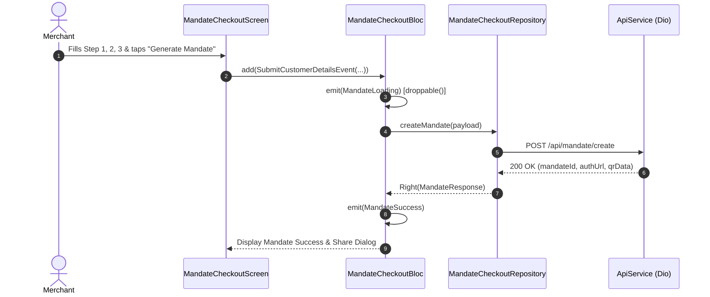

# Mandate Checkout Module Documentation

> **[🏠 Root README](../README.md) • [📚 Docs Hub](./README.md) • [🗺️ Architecture Flow](./project_architecture_and_flow.md) • [🚀 Open Interactive Portal](./index.html)**
> **Note:** These pages are specifically for **Developer Documentations**.

---

---

## 1. Overview & Business Context

- **Purpose:** Core monetization and subscription engine. Guides merchants and their customers through creating, reviewing, and authorizing recurring payment mandates (UPI AutoPay & e-NACH) with automated schedules.
- **Access Boundaries:** Authenticated users with completed KYC verification.
- **Supported Platforms:** Mobile, Tablet, Desktop, and Web.

---

---

## 2. End-to-End Module Flow & State Lifecycle

### 2.1 User Journey & Step-by-Step UI Flow

1. **Entry Trigger:** Merchant clicks "Create Mandate" from Dashboard or Customer Profile.
2. **Action / Interaction Steps:**
   - **Step 1 (Customer Identity):** Enter customer name and verified phone number.
   - **Step 2 (Financing Terms):** Input product details, principal amount, and processing fees.
   - **Step 3 (Repayment Schedule):** Select frequency (Weekly, Monthly, Yearly), installments count, first debit date, and inspect the dynamically generated preview schedule.
   - **Review & Generate:** User reviews summary and taps "Authorize Mandate Link".
3. **Async / Background Processing:**
   - `MandateCheckoutCubit` dispatches mandate generation request to backend.
   - UI presents modal loading overlays and disables back-navigation via `PopScope`.
4. **Outcome Branches:**
   - **Happy Path:** Mandate link/QR generated; merchant shares link via WhatsApp or customer scans QR to authorize via UPI.
   - **Failure Path:** Invalid schedule or API rejection triggers inline error correction.
5. **Exit / Terminal Route:** Navigates to Mandate Success confirmation or customer details ledger.

### 2.2 Architectural Sequence / Flow Diagram

---

---

## 3. Architecture & Code Structure

- **File Layout:**
  - `controllers/`: `mandate_checkout.bloc.dart`, `mandate_checkout.event.dart`, `mandate_checkout.state.dart`
  - `data/`: `mandate_checkout.repository.dart`
  - `screens/`: `mandate_checkout.screen.dart`
  - `widgets/`: `mandate_checkout_components.widget.dart`, `schedule_preview_dialog.widget.dart`
- **Core Dependencies:** Injected via `locator<MandateCheckoutRepository>()`.

---

---

## 4. State Management (BLoC / Cubit)

- **Controller Name:** `MandateCheckoutBloc`.
- **Concurrency Transformers:**
  - `droppable()`: Applied to `SubmitCustomerDetailsEvent`, `RecordOrderHistoryEvent`, and `RecordOrderHistoryByPaymentIdEvent` to prevent duplicate checkout/payment submissions.
- **States:** Sealed class hierarchy (`MandateCheckoutInitialState`, `MandateCheckoutLoadingState`, `MandateCheckoutFormLoadedState`, `MandateCheckoutSubmittingState`, `MandateCheckoutSuccessState`, `MandateCheckoutErrorState`).

---

---

## 5. API & Data Layer Contracts

- **Endpoints:**
  - `GET /api/emandate/emi-frequencies`: Available frequency definitions.
  - `POST /api/mandate/create`: Mandate registration payload.
- **Repository Interface & Implementation:** Standardized non-throwing contracts returning `TaskEither<ApiFailure, T>`.

---

---

## 6. UI, Design Tokens & Mandatory Assets

- **Asset Registry:** Generated payment icons and brand badges via `Assets.*`.
- **Core Widget Reusability:** Standardized on `PrimaryButton`, `CustomTextField`, `ConfirmationDialog`, `ExportSelectionDialog`.
- **Design Tokens & Theme Palette Switch (`lib/core/theme/`):** All wizard elements, cards, and sub-widgets strictly import design system tokens from `lib/core/theme/theme.dart` as defined in the [Theme & Responsive System User Manual](./theme_and_responsive_system.md). All UI components bind colors dynamically via `context.colors` (`context.colors.card`, `context.colors.textPrimary`, `context.colors.cardBorder`, `context.colors.primary`), typography via `AppTextStyles`, spacing via `AppSpacing.*Responsive` or `context.screenPadding`, radii via `AppBorderRadius.*Responsive`, and shadows via `AppShadows.card(isDark: context.isDark)`. This guarantees dynamic palette skinning across SASS brand presets (`goldLuxury`, `fintechBlue`, `emerald`, `corporateIndigo`) via `AppThemeConfig` and automatic light/dark mode adaptation without hardcoded color overrides.

---

---

## 7. Multi-Platform & Error Handling Strategy

- **Platform Handling:** Mobile uses touch-friendly accordion cards; Desktop uses side-by-side wizard with persistent live schedule preview.
- **Failure Matrix:** Validation and payment gateway timeouts mapped cleanly to user dialogs.

---

---

## 8. Verification & Test Suite

- Unit test suite at `test/modules/mandate_checkout/`.

---

---

### 🧭 Module Navigation

|            ⬅️ Previous Module            |        🏠 Documentation Hub         |                ➡️ Next Module                 |
| :---

--------------------------------------: | :---------------------------------: | :-------------------------------------------: |
| [⬅️ KYC Verification Pipeline](./kyc.md) | **[📚 Connected Hub](./README.md)** | [Customer CRM & Management ➡️](./customer.md) |

## 9. Quality Enforcement
- Koi bhi feature PR / commit tab tak pass nahi mana jayega jab tak uske flow diagrams aur step-by-step user journey documentation `docs/developer_docs/[feature_name].md` me update na ho chuki ho.
