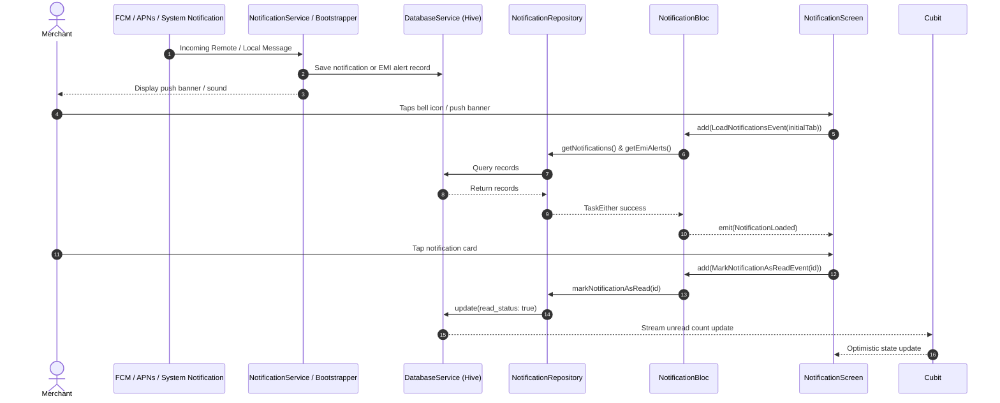

# Notifications & Alerts Module Documentation

> **[🏠 Root README](../README.md) • [📚 Docs Hub](./README.md) • [🗺️ Architecture Flow](./project_architecture_and_flow.md) • [🚀 Open Interactive Portal](./index.html)**
> **Note:** These pages are specifically for **Developer Documentations**.

---

---

## 1. Overview & Business Context

- **Purpose:** In-app Notification Center and real-time push alert router. Delivers urgent debit notifications, mandate authorization status changes, EMI recovery updates, and promotional broadcast announcements.
- **Access Boundaries:** Authenticated users via `AppRoutes.notifications`. Accessible directly through the Top AppBar notification icon or OS system notifications.
- **Supported Platforms:** Mobile (Android/iOS APNs/FCM & local notifications), Desktop (System tray & `local_notifier`), and Web.

---

---

## 2. End-to-End Module Flow & State Lifecycle

### 2.1 User Journey & Step-by-Step UI Flow

1. **Entry Trigger:** User taps the notification bell icon on Top App Bar (`HomeHeader`) or interacts with incoming OS push banner (`NotificationService` foreground response or terminated launch payload).
2. **Action / Interaction Steps:**
   - User views segmented tabs: **Announcements** (`selectedTab: 0`) and **EMI Alerts** (`selectedTab: 1`).
   - Each tab displays live counter pills showing unread counts.
   - User taps an alert to mark it as read optimistically.
   - User taps "View Mandate" on an EMI recovery alert to jump directly to `AppRoutes.customerDetails`.
   - User swipes left to dismiss and delete an individual notification card.
   - User taps "Mark All as Read" in the top bar to mark all records as read across both categories.
3. **Async / Background Processing:**
   - Updates local Hive DB (`fpmandateRetailerNotifications` and `fpmandateRetailerEMIAlerts`) read state.
   - Dispatches changes to `DatabaseService.notifyChange()`, which notifies reactive stream subscribers.
4. **Outcome Branches:**
   - **Happy Path:** Notification marked as read, badge count decremented, and route opened.
   - **Empty State:** `NotificationEmptyStateWidget` renders with a gold icon and localized copy.
5. **Exit / Terminal Route:** Returns to dashboard or navigates to the customer mandate details screen (`AppRoutes.customerDetails`).

### 2.2 Architectural Sequence / Flow Diagram

---

---

## 3. Architecture & Code Structure

- **File Layout:**
  - Barrel: `lib/modules/notification/notification.dart`
  - Controllers:
    - `lib/modules/notification/controllers/notification.cubit.dart`
    - `lib/modules/notification/controllers/notification.state.dart`
  - Data:
    - `lib/modules/notification/data/notification.repository.dart`
  - Screens:
    - `lib/modules/notification/screens/notification.screen.dart`
  - Sub-Widgets:
    - `lib/modules/notification/widgets/notification_tab_bar.widget.dart`
    - `lib/modules/notification/widgets/notification_item.widget.dart`
    - `lib/modules/notification/widgets/emi_alert_item.widget.dart`
    - `lib/modules/notification/widgets/notification_empty_state.widget.dart`
- **Core Dependencies:**
  - `DatabaseService` (`lib/core/services/database.service.dart`)
  - `NotificationService` (`lib/core/services/notification.service.dart`)
  - `AppRoutes` (`lib/core/routes/app_routes.dart`)

---

---

## 4. State Management (BLoC / Cubit)

- **Controller Name:** `NotificationCubit`
- **States:**
  - `NotificationInitial`
  - `NotificationLoading`
  - `NotificationLoaded` (`notifications`, `emiAlerts`, `selectedTab`, `unreadCount`, `isActionInProgress`, `message`)
  - `NotificationError` (`message`)
- **Reactive Stream Integration:** Subscribes to `DatabaseService.getTotalUnreadCountStream()` to synchronize unread badge counts across navigation without manual polling.

---

---

## 5. API & Data Layer Contracts

- **Local Storage Tables:**
  - `tableNotifications` (`fpmandateRetailerNotifications`)
  - `tableEMIAlerts` (`fpmandateRetailerEMIAlerts`)
- **Repository Interface:** `INotificationRepository`
  - Returns non-throwing functional outcome `TaskEither<ApiFailure, T>`
  - Encapsulates all Hive queries and updates without leaking exceptions.

---

---

## 6. UI, Design Tokens & Mandatory Assets

- **Design Tokens & Theme Palette Switch (`lib/core/theme/`):** All notification components strictly import design system tokens from `lib/core/theme/theme.dart` as defined in the [Theme & Responsive System User Manual](./theme_and_responsive_system.md). All UI components bind colors dynamically via `context.colors` (`context.colors.card`, `context.colors.textPrimary`, `context.colors.cardBorder`, `context.colors.primary`), typography via `AppTextStyles`, spacing via `AppSpacing.*Responsive` or `context.screenPadding`, radii via `AppBorderRadius.*Responsive`, and shadows via `AppShadows.card(isDark: context.isDark)`. This guarantees dynamic palette skinning across SASS brand presets (`goldLuxury`, `fintechBlue`, `emerald`, `corporateIndigo`) via `AppThemeConfig` and automatic light/dark mode adaptation without hardcoded color overrides.
- **Responsive Sizing:**
  - Scaled via `.rw`, `.rh`, `.rsp`, `.rr` tokens.
  - Sub-widgets encapsulated in `lib/modules/notification/widgets/`.
- **Localization:**
  - 100% Slang translation keys under `t.notification.*`.

---

---

## 7. Multi-Platform & Error Handling Strategy

- **Mobile:** Android `NotificationChannel` with high priority, iOS presentation options, sound asset playback.
- **Desktop:** macOS, Windows, Linux native notifications via `local_notifier`.
- **Error Boundaries:** Repository absorbs storage errors and surfaces typed failures mapped to `NotificationError`.

---

---

## 8. Verification & Test Suite

- Unit test suite at `test/modules/notification/notification.cubit_test.dart`.
- Clean passes for `fvm dart run slang`, `fvm flutter analyze --fatal-infos --fatal-warnings`, and `fvm flutter test`.

---

---

### 🧭 Module Navigation

|                   ⬅️ Previous Module                   |        🏠 Documentation Hub         |               ➡️ Next Module               |
| :---

----------------------------------------------------: | :---------------------------------: | :----------------------------------------: |
| [⬅️ Razorpay Integration](./razorpay_backend_guide.md) | **[📚 Connected Hub](./README.md)** | [Settings & Preferences ➡️](./settings.md) |

## 9. Quality Enforcement
- Koi bhi feature PR / commit tab tak pass nahi mana jayega jab tak uske flow diagrams aur step-by-step user journey documentation `docs/developer_docs/[feature_name].md` me update na ho chuki ho.
