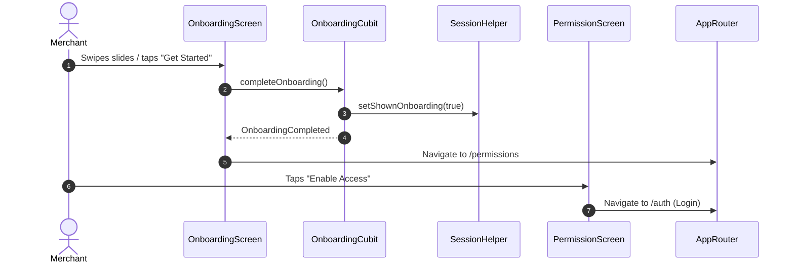

# Onboarding & Permissions Module Documentation

> **[🏠 Root README](../README.md) • [📚 Docs Hub](./README.md) • [🗺️ Architecture Flow](./project_architecture_and_flow.md) • [🚀 Open Interactive Portal](./index.html)**
> **Note:** These pages are specifically for **Developer Documentations**.

---

---

## 1. Overview & Business Context

- **Purpose:** Welcomes first-time merchants and introduces core value propositions (recurring payment collection, digital e-mandates, bank-grade NPCI security). Manages essential OS runtime permission requests (Camera, Notifications).
- **Access Boundaries:** Publicly accessible. Shown strictly once on fresh app installs.
- **Supported Platforms:** Mobile (swipeable glassmorphic carousel), Tablet / Desktop / Web (split-screen interactive showcase).

---

---

## 2. End-to-End Module Flow & State Lifecycle

### 2.1 User Journey & Step-by-Step UI Flow

1. **Entry Trigger:** Cold app launch where `SessionHelper.has_shown_onboarding` is false. Routed to `/onboarding`.
2. **Action / Interaction Steps:**
   - User swipes through 5 onboarding slides highlighting business value.
   - User clicks "Continue" to step forward or "Skip" to jump ahead.
   - On final slide, user taps "Get Started" to navigate to `/permissions`.
   - On permissions screen, user reviews camera & notification access cards and taps "Enable Access".
3. **Async / Background Processing:**
   - `OnboardingCubit` tracks active page index and updates `SessionHelper`.
   - `PermissionCubit` requests OS permission dialogues.
4. **Outcome Branches:**
   - **Happy Path:** Permissions granted or acknowledged; user redirected to `/auth` (Login).
5. **Exit / Terminal Route:** Navigates to Login screen.

### 2.2 Architectural Sequence / Flow Diagram

---

---

## 3. Architecture & Code Structure

- **File Layout:**
  - `controllers/`: `onboarding.cubit.dart`, `onboarding.state.dart`, `permission/`
  - `models/`: `onboarding_page.model.dart`
  - `screens/`: `onboarding.screen.dart`, `permission.screen.dart`
  - `widgets/`:
    - `onboarding_mobile_layout.widget.dart`, `onboarding_desktop_layout.widget.dart`
    - `onboarding_carousel.widget.dart`, `onboarding_text_card.widget.dart`
    - `onboarding_controls.widget.dart`, `permission/*`
- **Core Dependencies:** Injected `SessionHelper`, Slang translations via `t.onboarding`.

---

---

## 4. State Management (BLoC / Cubit)

- **Controller Name:** `OnboardingCubit`, `PermissionCubit`.
- **States:** Sealed states (`OnboardingInitial`, `OnboardingCompleted`).

---

---

## 5. API & Data Layer Contracts

- **Endpoints:** Purely client-side state.
- **Persistence:** Local settings via `SessionHelper` (`SharedPreferences`).

---

---

## 6. UI, Design Tokens & Mandatory Assets

- **Asset Registry:** Accesses generated illustrations via `Assets.images.onboarding.*`.
- **Core Widget Reusability:** Standardized on `PrimaryButton`.
- **Design Tokens & Theme Palette Switch (`lib/core/theme/`):** All onboarding components strictly import design system tokens from `lib/core/theme/theme.dart` as defined in the [Theme & Responsive System User Manual](./theme_and_responsive_system.md). All UI components bind colors dynamically via `context.colors` (`context.colors.surface`, `context.colors.card`, `context.colors.primary`), typography via `AppTextStyles`, spacing via `AppSpacing.*Responsive` or `context.screenPadding`, radii via `AppBorderRadius.*Responsive`, and shadows via `AppShadows.card(isDark: context.isDark)`. This guarantees dynamic palette skinning across SASS brand presets (`goldLuxury`, `fintechBlue`, `emerald`, `corporateIndigo`) via `AppThemeConfig` and automatic light/dark mode adaptation without hardcoded color overrides.
- **UI Sub-components:** Zero helper methods returning widgets; all buttons decomposed into dedicated `StatelessWidget` sub-components (`_OnboardingMobileSkipButton`, `_OnboardingDesktopSkipButton`, `_OnboardingFullWidthButton`).

---

---

## 7. Multi-Platform & Error Handling Strategy

- **Platform Handling:** `ResponsiveLayout` segregates mobile full-bleed layout from desktop split-screen showcase.
- **Failure Matrix:** Denied permissions handle soft warnings without blocking authentication progression.

---

---

## 8. Verification & Test Suite

- Unit test suite at `test/modules/onboarding/`.

---

---

### 🧭 Module Navigation

|            ⬅️ Previous Module            |        🏠 Documentation Hub         |             ➡️ Next Module             |
| :---

--------------------------------------: | :---------------------------------: | :------------------------------------: |
| [⬅️ Splash & Bootstrapping](./splash.md) | **[📚 Connected Hub](./README.md)** | [Authentication & Login ➡️](./auth.md) |

## 9. Quality Enforcement
- Koi bhi feature PR / commit tab tak pass nahi mana jayega jab tak uske flow diagrams aur step-by-step user journey documentation `docs/developer_docs/[feature_name].md` me update na ho chuki ho.
