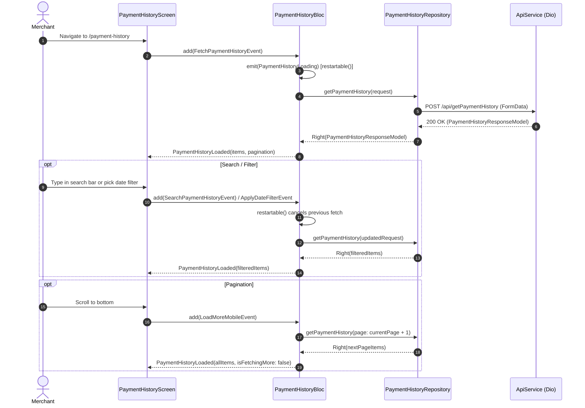

# Payment History Module Documentation

> **[🏠 Root README](../README.md) • [📚 Docs Hub](./README.md) • [🗺️ Architecture Flow](./project_architecture_and_flow.md)**
> **Note:** These pages are specifically for **Developer Documentations**.

---

## 1. Overview & Business Context

- **Purpose:** Provides merchants with a paginated, searchable, and filterable view of all EMI payment transactions across their customer base — showing per-EMI status, amounts, payment dates, transaction IDs, fees, and payment methods.
- **Access Boundaries:** Authenticated merchants only. Accessible via the Premium Side Drawer (`PremiumDrawerWidget`) and bottom navigation shortcuts.
- **Supported Platforms:** Mobile (Android, iOS), Desktop (macOS, Windows, Linux), Web via `ResponsiveLayout`.

---

## 2. End-to-End Module Flow & State Lifecycle

### 2.1 User Journey & Step-by-Step UI Flow

1. **Entry Trigger:** User taps "Payment History" in the Premium Drawer or navigates to `/payment-history` via `GoRouter`.
2. **Action / Interaction Steps:**
   - On mount, `FetchPaymentHistoryEvent(forceRefresh: false)` is dispatched automatically via `initState` on **both Mobile and Desktop**.
   - User may type in the search bar (`PaymentHistorySearchBarWidget`) → triggers `SearchPaymentHistoryEvent(query)` with `restartable()` debounce.
   - User selects a date range filter → triggers `ApplyDateFilterEvent(filter, fromDate, toDate)`.
   - User pulls down to refresh → triggers `FetchPaymentHistoryEvent(forceRefresh: true)`.
   - User scrolls near the bottom of the mobile list → triggers `LoadMoreMobileEvent()` for infinite scroll pagination.
3. **Async / Background Processing:** `PaymentHistoryBloc` dispatches to `PaymentHistoryRepository` → `ApiService` (Dio POST with FormData). UI shows `AnimatedImageLoader` during load; a non-intrusive fetch-more indicator at list bottom during pagination.
4. **Outcome Branches:**
   - **Happy Path:** `PaymentHistoryLoaded` emitted — mobile list renders `PaymentHistoryItemWidget` cards; desktop renders `DesktopPaymentHistoryListWidget` table.
   - **Empty State:** `CustomerEmptyStateWidget` (shared from customer module) is rendered inside an `AlwaysScrollableScrollPhysics` `ListView` to preserve pull-to-refresh.
   - **Error Path:** `PaymentHistoryError` emitted — screen displays inline error message via `BlocListener`.
5. **Exit / Terminal Route:** User taps the system back button or navigates away via bottom nav; `PaymentHistoryBloc` persists its last loaded state.

### 2.2 Architectural Sequence / Flow Diagram

---

## 3. Architecture & Code Structure

- **File Layout:**
  - `controllers/`: `payment_history.bloc.dart`, `payment_history.event.dart`, `payment_history.state.dart`
  - `data/`: `payment_history.repository.dart`
  - `models/`: `payment_history.model.dart` (`PaymentHistoryItemModel`, `PaymentHistoryPaginationModel`, `PaymentHistoryResponseModel`), `payment_history.list.request.model.dart`
  - `screens/`: `payment_history.screen.dart`
  - `widgets/`:
    - `search/`: `payment_history.search.bar.widget.dart`, `payment_history.date.filter.widget.dart`
    - `list/`: `mobile.payment_history.list.widget.dart`, `desktop.payment_history.list.widget.dart`
    - `item/`: `payment_history.item.widget.dart`

- **Public Barrel:** `payment_history.dart` — exports only controllers, models, and the entry screen. Widget sub-folders are strictly internal.
- **Core Dependencies:** `locator<PaymentHistoryRepository>()`, `locator<ApiService>()`.

---

## 4. State Management (BLoC)

- **Controller Name:** `PaymentHistoryBloc`
- **Concurrency Transformers:**
  - `restartable()`: Applied to `FetchPaymentHistoryEvent`, `SearchPaymentHistoryEvent`, and `ApplyDateFilterEvent` — cancels any in-flight API call when a new search/filter is triggered.
  - `droppable()`: Applied to `LoadMoreMobileEvent` — prevents duplicate pagination calls during scroll.

### Events

| Event | Payload | Purpose |
| --- | --- | --- |
| `FetchPaymentHistoryEvent` | `forceRefresh: bool` | Initial load or pull-to-refresh |
| `SearchPaymentHistoryEvent` | `query: String` | Debounced search by name or reg no |
| `ApplyDateFilterEvent` | `filter, fromDate, toDate` | Date range filtering |
| `LoadMoreMobileEvent` | — | Infinite scroll — fetch next page |
| `ResetPaymentHistoryEvent` | — | Clears state to initial |

### States

| State | Key Fields | Description |
| --- | --- | --- |
| `PaymentHistoryInitial` | — | Module not yet loaded |
| `PaymentHistoryLoading` | — | First fetch or hard refresh in progress |
| `PaymentHistoryLoaded` | `items`, `displayedItems`, `pagination`, `isRefreshing`, `isFetchingMore`, `searchQuery`, `dateFilter` | Active state with full dataset |
| `PaymentHistoryError` | `message` | Repository returned a `Failure` |

---

## 5. API & Data Layer Contracts

- **Endpoint:** `POST /api/getPaymentHistory`
- **Request Body (FormData):** Defined in `PaymentHistoryListRequestModel`

| Field | Type | Description |
| --- | --- | --- |
| `page` | `int` | Current page (1-indexed) |
| `per_page` | `int` | Items per page (default: 10) |
| `search` | `String` | Name or registration number filter |
| `date_filter` | `String` | `'all'`, `'today'`, `'this_week'`, `'this_month'`, `'custom'` |
| `from_date` | `String` | `YYYY-MM-DD` (only when `date_filter == 'custom'`) |
| `to_date` | `String` | `YYYY-MM-DD` (only when `date_filter == 'custom'`) |

- **Repository Contract:** `PaymentHistoryRepository.getPaymentHistory(request)` → returns `Result<PaymentHistoryResponseModel, Failure>`. **Never throws.** All `DioException`, `SocketException`, and `FormatException` are absorbed internally and mapped to typed `Failure`.

---

## 6. UI, Design Tokens & Mandatory Assets

### Widget Responsibility Map

| Widget | Location | Responsibility |
| --- | --- | --- |
| `PaymentHistoryScreen` | `screens/` | Layout composition, `BlocConsumer` wiring, `ResponsiveLayout` switch |
| `PaymentHistorySearchBarWidget` | `widgets/search/` | Search text input + export button |
| `PaymentHistoryDateFilterWidget` | `widgets/search/` | Date range chip selector |
| `MobilePaymentHistoryListWidget` | `widgets/list/` | Infinite-scroll `ListView` for mobile/tablet |
| `DesktopPaymentHistoryListWidget` | `widgets/list/` | Data table layout for desktop/web |
| `PaymentHistoryItemWidget` | `widgets/item/` | Individual payment card — avatar, status strip, financial dashboard, CTA |

### Design Language (mirrors `MobileCustomerCard`)

- **Card:** `ClayContainer(depth: 0.8)` — theme-aware neumorphic depth
- **Top Status Strip:** Colored alert banner (`success`=SUCCESS, `error`=FAILED) with `border-bottom` divider
- **Right Badge in Strip:** Payment method chip (UPI/CARD/NETBANKING) with matching icon
- **Avatar:** Gradient initials rounded square — color driven by payment status
- **Avatar animation:** `.animate(delay: 100ms).scale(easeOutBack)`
- **Inner Financial Panel:** Translucent bordered container with EMI #, paid/due date, VPA, amount, status badge
- **Progress Bar:** `TweenAnimationBuilder<double>` 1200ms `easeOutCubic` `LinearProgressIndicator` (fills to 100% when paid)
- **CTA Button:** `View >` with coloured shadow + `.animate(delay: 400ms).fadeIn().slideX()`
- **Card entrance animation:** `.animate().fadeIn(300ms).slideY(begin: 0.08, curve: easeOutQuad)`

### Design Tokens

- Colors strictly via `context.colors.*` — `success`, `error`, `primary`, `accent`, `textPrimary`, `textSecondary`, `pillBackground`
- Typography via `AppTextStyles.*` — `subtitle1`, `caption`, `body2`
- Spacing via `AppSpacing.*Responsive` and `.rw`, `.rh`, `.rsp`, `.rr` extensions
- Shadows via `AppShadows.subtle(isDark: context.isDark)`
- Radii via `AppBorderRadius.allLgResponsive` and `18.rr`

---

## 7. Multi-Platform & Error Handling Strategy

- **Mobile/Tablet:** `MobilePaymentHistoryListWidget` — infinite scroll + pull-to-refresh + `CustomerEmptyStateWidget` fallback.
- **Desktop/Web:** `DesktopPaymentHistoryListWidget` — `DesktopDataTable` core component for consistent high-density table layout with hover highlights.
- **Platform switch:** `ResponsiveLayout(mobile: ..., desktop: ...)` inside `PaymentHistoryScreen`.

### Failure Matrix

| Failure Type | Mapped To | User Feedback |
| --- | --- | --- |
| Network timeout | `NetworkFailure` | Inline `PaymentHistoryError` state |
| 401 Unauthorized | `AuthFailure` | Session refresh via `AuthBloc` |
| Non-2xx response | `ServerFailure` | Error message in `PaymentHistoryError` |
| JSON decode error | `ParseFailure` | Error state with generic message |

---

## 8. Verification & Test Suite

- Unit tests at `test/modules/payment_history/`:
  - `PaymentHistoryBloc` event→state transition tests
  - Mocktail `PaymentHistoryRepository` for offline resilience
  - Pagination boundary: `LoadMoreMobileEvent` dispatched only when `hasNextPage == true`

---

## 9. Quality Enforcement

No feature PR/commit is valid until this document is updated to reflect any changes in business logic, API contracts, routing, or state transitions per `AGENTS.md` Rule 10.

---

### 🧭 Module Navigation

|              ⬅️ Previous Module              |        🏠 Documentation Hub         |              ➡️ Next Module              |
| :------------------------------------------: | :---------------------------------: | :--------------------------------------: |
| [⬅️ Customer](./customer.md) | **[📚 Connected Hub](./README.md)** | [Wallet ➡️](./wallet.md) |
