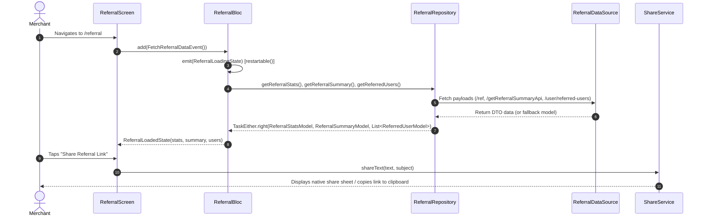

# Refer & Earn Rewards Module Documentation

> **[🏠 Root README](../README.md) • [📚 Docs Hub](./README.md) • [🗺️ Architecture Flow](./project_architecture_and_flow.md) • [🚀 Open Interactive Portal](./index.html)**
> **Note:** These pages are specifically for **Developer Documentations**.

---

---

## 1. Overview & Business Context

- **Purpose:** Governs the merchant growth and referral rewards ecosystem. Allows merchants to invite fellow business owners to FinancePe using a unique referral code/link.
- **The 3-Stage Pipeline (Marketing Logic):** Referrers track their invitees across a gamified funnel:
  1. **Registered:** Invitee signs up using the referral code. (Status: Pending)
  2. **KYC Completed:** Invitee completes document verification. (Status: Pending)
  3. **E-Mandate Done:** Invitee successfully registers a collection mandate. (Status: Rewarded). Bonus coins are strictly credited to the referrer only upon completion of this final stage.
- **Access Boundaries:** Authenticated merchants (`AuthAuthenticated`). Integrated with `RootScaffold` (Tab index 8) and accessible via `PremiumDrawer` under the Rewards section.
- **Supported Platforms:** Mobile (native share sheet via `ShareService`, clipboard copy), Desktop & Web (clamped responsive layouts, side-by-side analytics grid).

---

---

## 2. End-to-End Module Flow & State Lifecycle

### 2.1 User Journey & Step-by-Step UI Flow

1. **Entry Trigger:** User taps "Refer & Earn" in the navigation drawer (`PremiumDrawer`), bottom navigation, or quick action card.
2. **Action / Interaction Steps:**
   - **View Referral Code & Link:** User inspects their custom referral code (`FINPE2026`).
   - **Copy / Share Action:** User taps "Copy" or "Share Referral Link", invoking native share sheet or clipboard notification. The generated share message distributes a dual-link strategy: a direct Google Play Store install link (`?referrer=:code`) for Android users, and a fallback Universal Link (`financepe.in/ref/:code`) for iOS/Web users.
   - **Deep Link Navigation & Onboarding:** Referees opening `/ref/:code` or `/referral/:code` are routed to Login/Register without 400 errors. The incoming referral code is automatically saved into the session.
   - **Auth Integration & Manual Entry:** Instead of KYC, the stored referral code is automatically injected into the Auth flow (`sendOtp` and `verifyOtp` API payloads). Users without a link can also manually enter a referral code via a premium animated button (powered by `flutter_animate`) that triggers an adaptive form (BottomSheet on mobile, Dialog on desktop) directly from the Login screen.
   - **Track Referred Partners:** User reviews a premium gamified dashboard highlighting absolute "Coins Earned" alongside the detailed Referral Pipeline funnel (Total Referrals -> Registered -> KYC Done -> Mandate Active). Users in the pipeline but without an active mandate are badged as "Pending" to nudge follow-ups.
3. **Async / Background Processing:** `ReferralBloc` dispatches `FetchReferralDataEvent`, requesting statistics and partner onboarding progress.
4. **Outcome Branches:**
   - **Happy Path (3-Stage Funnel):** Merchant shares link -> Referee registers -> Referee verifies KYC -> Referee activates Mandate. Bonus coins are strictly credited *only* upon successful Mandate activation.
   - **Failure / Edge Case Path:** Network failure triggers retry state; fallback mock statistics guarantee continuous offline responsiveness; router `errorBuilder` prevents 400 popups.
5. **Exit / Terminal Route:** Navigates back to Dashboard or Wallet screen.

### 2.2 Architectural Sequence / Flow Diagram



---

---

## 3. Architecture & Code Structure

### 3.1 File Layout

```bash
lib/modules/referral/
├── referral.dart                           # Module Public API Surface (Barrel File)
├── controllers/
│   ├── referral.bloc.dart                  # Business Logic Controller (Concurrency Transformers)
│   ├── referral.event.dart                 # Sealed Event Classes
│   └── referral.state.dart                 # Sealed State Classes
├── data/
│   ├── referral.datasource.dart            # Low-Level Network Communication & Fallbacks
│   └── referral.repository.dart            # Functional Non-Throwing Repository Contract
├── models/
│   ├── referral_stats.model.dart           # Referral Statistics DTO
│   ├── referral_summary.model.dart         # Referral Summary DTO
│   └── referred_user.model.dart            # Referred Merchant Partner Entity
├── screens/
│   └── referral.screen.dart                # Responsive Multi-Platform Entry Screen
└── widgets/
    ├── desktop_referral_layout.widget.dart # Desktop Referral Layout
    ├── mobile_referral_layout.widget.dart  # Mobile Referral Layout
    ├── leaderboard.widget.dart             # Gamified Live Leaderboard Carousel
    ├── referral_code_card.widget.dart      # VIP Access Key (Glowing Copy & Launch Share Button)
    ├── referral_hero_card.widget.dart      # Program Incentive Banner
    ├── referral_how_it_works.widget.dart   # Interactive Gamified Quest Timeline (3-Stage Breakdown)
    ├── referral_stats_grid.widget.dart     # Gamified Funnel KPI Grid (Glassmorphism Vault & XP Bars)
    └── referred_users_list.widget.dart     # Filterable Partner List Component
```

### 3.2 Core Dependencies

- `IReferralRepository` injected via `locator<ReferralRepository>()`.
- `ShareService` (`lib/core/services/share.service.dart`) for platform-agnostic link distribution.

---

---

## 4. State Management (BLoC / Cubit)

- **Controller Name:** `ReferralBloc`
- **Events:** `FetchReferralDataEvent`, `RefreshReferralDataEvent`, `CopyReferralCodeEvent`, `ShareReferralLinkEvent`, `LoadMoreReferredUsersEvent`, `ChangeReferralDesktopPageEvent`, `FilterReferredUsersEvent`, `FetchLeaderboardEvent`.
- **States:** Sealed hierarchy (`ReferralInitialState`, `ReferralLoadingState`, `ReferralLoadedState`, `ReferralErrorState`).
  - `ReferralLoadedState` manages strict pagination states (`currentPage`, `totalPages`, `totalUsers`, `perPage`, `hasReachedMax`, `isFetchingMore`) ensuring bulletproof rendering on scroll triggers, along with `leaderboard` arrays for gamified rankings.
- **Transformers & Concurrency:**
  - `restartable()`: Applied to `FetchReferralDataEvent`, `RefreshReferralDataEvent`, `ChangeReferralDesktopPageEvent`, and `FilterReferredUsersEvent` to cancel stale in-flight requests.
  - `droppable()`: Strictly applied to `LoadMoreReferredUsersEvent` (Mobile Infinite Scroll) to debounce fast scrolling and prevent redundant API multi-fetches.

---

---

## 5. API & Data Layer Contracts

- **Endpoints (Registered in `ReferralApi`):**
  - `POST /api/ref` (`Api.referralApi.getReferralStats`): Retrieves the specific merchant's referral code and base link.
  - `GET /api/getReferralSummaryApi` (`Api.referralApi.getReferralSummary`): Retrieves the detailed 7-point gamified marketing summary (earnings and pipeline stages).
  - `POST /api/getReferralListApi` (`Api.referralApi.getReferralList`): Retrieves detailed list of merchant signups.
  - `GET /api/getLeaderBord` (`Api.referralApi.getLeaderboard`): Retrieves the live leaderboard of top-earning merchants based on total reward coins.
- **Repository Interface & Implementation:**
  - `TaskEither<ApiFailure, ReferralStatsModel> getReferralStats()`
  - `TaskEither<ApiFailure, ReferralSummaryModel> getReferralSummary()`
  - `TaskEither<ApiFailure, ReferredUsersResponseModel> getReferredUsers(...)`
  - `TaskEither<ApiFailure, List<LeaderboardEntryModel>> getLeaderboard()`
  - Encapsulates all transport and parsing exceptions internally without throwing. Fallback values handle missing payloads gracefully (e.g., yielding `referralCode: ''`).

---

---

## 6. UI, Design Tokens & Mandatory Assets

- **Pagination & Multi-Platform Adaptive Lists:**
  - **Mobile:** Implements `NotificationListener<ScrollNotification>` wrapped around `RefreshIndicator`. Automatically triggers `LoadMoreReferredUsersEvent` when scroll offset reaches `maxScrollExtent - 200`. Infinite scroll leverages `isFetchingMore` to dynamically inject a circular loader at the tail of the list.
  - **Desktop:** Segregates UI into a unified `DesktopDataTable` format which natively handles pagination, column sorting, and flexible constraints. Replaces the entire payload on `ChangeReferralDesktopPageEvent` with `isFiltering` loader toggles.
- **Empty State Gamification:** Re-architected `_EmptyStateWidget` uses high-end `flutter_animate` staggered infinite loops (pulsing gold concentric rings) containing an explicit "Invite Friends Now" Call-To-Action button.
- **Direct Action CTAs:** "Call Partner" `IconButton` CTAs (executing `launchUrlString`) are directly injected into `_PremiumMilestoneTimelineWidget` and mobile/desktop list tiles for friction-less communication.
- **Design Tokens & Theme Palette Switch (`lib/core/theme/`):** Strictly imports design tokens from `lib/core/theme/theme.dart` as defined in the [Theme & Responsive System User Manual](./theme_and_responsive_system.md). Bind colors via `context.colors` (`context.colors.card`, `context.colors.textPrimary`, `context.colors.primary`), typography via `AppTextStyles`, spacing via `AppSpacing.*Responsive`, and radii via `AppBorderRadius.*Responsive`.
- **Gamification & Premium UX:** Leverages `flutter_animate` extensively for premium visual feedback, including animating XP/Level progression bars inside funnel cards, pulsing glowing buttons (`scale` and `fade` loops on VIP access keys), and sequential staggering of timeline items and chevron arrows. Avoids native filter animations (`.shimmer()`, `.color()`) on unbounded elements to maintain strict rendering bounds.
- **Core Widgets Reusability:** Employs `CustomAppBar`, `CustomSnackbar`, `RootScaffold`, `PremiumDrawer`.
- **Sub-Widget Isolation:** Zero helper methods returning widgets; all UI cards segregated in isolated `StatelessWidget` / `StatefulWidget` files in `widgets/`.

---

---

## 7. Multi-Platform & Deep Linking Strategy

### 7.1 Deep Linking Architecture (100% Free / Native)

The referral module relies on a dual-layer, zero-dependency deep linking architecture to track referrals across platforms:

- **Layer 1: Installed App (Native Universal Links)**
  - **Android (`AndroidManifest.xml`):** Configured with `<intent-filter android:autoVerify="true">` for `financepe.in`. Bypasses the browser and directs the URL straight to the Flutter engine.
  - **iOS (`Info.plist`):** Configured with `FlutterDeepLinkingEnabled`. Requires `Associated Domains` configured in Xcode.
  - **Web (`main.dart`):** `usePathUrlStrategy()` ensures clean URLs (e.g., `financepe.in/ref/ANK2337` instead of `/#/ref`). `GoRouter` reads path parameters seamlessly.
- **Layer 2: Deferred Deep Linking (Install Gap Tracking)**
  - Implemented via `DeferredDeepLinkService`, executed exactly once on first app launch to bridge the gap if a user goes to the App Store / Play Store.
  - **Android:** Uses the Google Play Install Referrer API (`android_play_install_referrer`) to parse the `?referrer=` payload from the Play Store installation link.
  - **iOS:** Uses the Clipboard workaround strategy (Website copies `FP_REF_CODE` to the iOS clipboard before redirecting to the App Store; the app reads and clears it on first launch).

### 7.2 Responsive Platform Handling

- **Layout Adjustments:** Mobile renders vertical scroll view with pull-to-refresh; Desktop renders side-by-side grid layout.
- **Failure Matrix:** API network failures trigger soft retries while displaying high-fidelity fallback statistics.

---

---

## 8. Verification & Test Suite

- Unit tests in `test/modules/referral/`:
  - `referral.bloc_test.dart`: Validates BLoC state transitions.
  - `referral.repository_test.dart`: Verifies non-throwing repository outcomes.

---

---

### 🧭 Module Navigation

|             ⬅️ Previous Module             |        🏠 Documentation Hub         |                   ➡️ Next Module                   |
| :----------------------------------------: | :---------------------------------: | :------------------------------------------------: |
| [⬅️ Credit Score & Risk](./credit_score.md) | **[📚 Connected Hub](./README.md)** | [Wallet & Coin Economy ➡️](./wallet.md)           |

## 9. Quality Enforcement
- Koi bhi feature PR / commit tab tak pass nahi mana jayega jab tak uske flow diagrams aur step-by-step user journey documentation `docs/developer_docs/[feature_name].md` me update na ho chuki ho.
