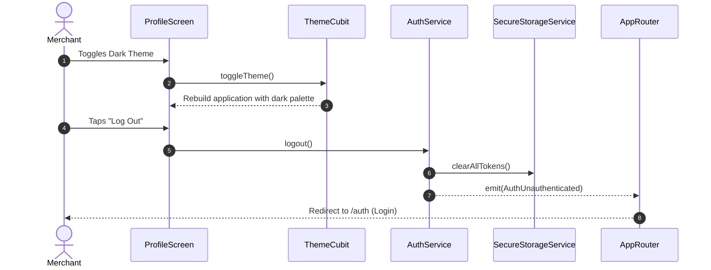

# Settings & Preferences Module Documentation

> **[🏠 Root README](../README.md) • [📚 Docs Hub](./README.md) • [🗺️ Architecture Flow](./project_architecture_and_flow.md) • [🚀 Open Interactive Portal](./index.html)**
> **Note:** These pages are specifically for **Developer Documentations**.

---

---

## 1. Overview & Business Context

- **Purpose:** Central management console for merchant profile details, business entity configurations, theme toggling, multi-language switching, desktop system settings, and secure session logout.
- **Access Boundaries:** Authenticated users (`AuthAuthenticated`).
- **Supported Platforms:** Mobile, Desktop, and Web.

---

---

## 2. End-to-End Module Flow & State Lifecycle

### 2.1 User Journey & Step-by-Step UI Flow

1. **Entry Trigger:** User taps Settings / Profile icon from Top App Bar or Bottom Navigation drawer.
2. **Action / Interaction Steps:**
   - User reviews account profile (Name, Trade Name, Phone, Email, Verified Bank Details) rendered via `SelectableText` for effortless long-press copying to clipboard.
   - User toggles app appearance (Dark Mode / Light Mode).
   - User changes app language (English, Hindi, etc.).
   - User taps "Log Out" to terminate active session.
3. **Async / Background Processing:** Updates `SharedPreferences` (Theme/Locale) and purges tokens from `SecureStorageService` upon logout.
4. **Outcome Branches:**
   - **Happy Path:** Preference saved instantly without restarting app.
   - **Logout:** Session cleared, user redirected to `/auth` (Login).
5. **Exit / Terminal Route:** Navigates back to dashboard or login screen.

### 2.2 Architectural Sequence / Flow Diagram

---

---

## 3. Architecture & Code Structure

- **File Layout:**
  - `screens/`: `profile.screen.dart`
  - `widgets/`: `profile_mobile_layout.widget.dart`, `profile_desktop_layout.widget.dart`, `profile_shared_components.widget.dart`, `buy_credit_score_coins.widget.dart`
  - Root module barrel: `settings.dart`
- **Core Dependencies:** Injected `AuthService`, `ThemeCubit`, `LocaleCubit`.

---

---

## 4. State Management (BLoC / Cubit)

- **Controller Strategy:** Communicates directly with global core singletons (`ThemeCubit`, `LocaleCubit`, `AuthBloc`).

---

---

## 5. API & Data Layer Contracts

- **Endpoints:** Profile fetch `/api/profile`, session termination `/api/logout`.
- **Repository Interface & Implementation:** Standardized non-throwing contracts.

---

---

## 6. UI, Design Tokens & Mandatory Assets

- **Asset Registry:** Accesses settings icons via `Assets.*`.
- **Core Widget Reusability:** Standardized on `RootScaffold`, `CustomAppBar`, `PrimaryButton`.
- **Design Tokens & Theme Palette Switch (`lib/core/theme/`):** All profile and settings components strictly import design system tokens from `lib/core/theme/theme.dart` as defined in the [Theme & Responsive System User Manual](./theme_and_responsive_system.md). All UI components bind colors dynamically via `context.colors` (`context.colors.card`, `context.colors.textPrimary`, `context.colors.cardBorder`, `context.colors.primary`), typography via `AppTextStyles`, spacing via `AppSpacing.*Responsive` or `context.screenPadding`, radii via `AppBorderRadius.*Responsive`, and shadows via `AppShadows.card(isDark: context.isDark)`. This guarantees dynamic palette skinning across SASS brand presets (`goldLuxury`, `fintechBlue`, `emerald`, `corporateIndigo`) via `AppThemeConfig` and automatic light/dark mode adaptation without hardcoded color overrides.

---

---

## 7. Multi-Platform & Error Handling Strategy

- **Platform Handling:** Desktop provides system options (Launch at startup, Minimize to tray); Mobile provides native app info dialogs.
- **Failure Matrix:** Network drops during logout still execute local storage cleanup.

---

---

## 8. Verification & Test Suite

- Unit test suite under `test/modules/settings/`.

---

---

### 🧭 Module Navigation

|               ⬅️ Previous Module               |        🏠 Documentation Hub         |                ➡️ Next Module                |
| :---

--------------------------------------------: | :---------------------------------: | :------------------------------------------: |
| [⬅️ Notifications & Alerts](./notification.md) | **[📚 Connected Hub](./README.md)** | [Error Handling & Fallbacks ➡️](./errors.md) |

## 9. Quality Enforcement
- Koi bhi feature PR / commit tab tak pass nahi mana jayega jab tak uske flow diagrams aur step-by-step user journey documentation `docs/developer_docs/[feature_name].md` me update na ho chuki ho.
