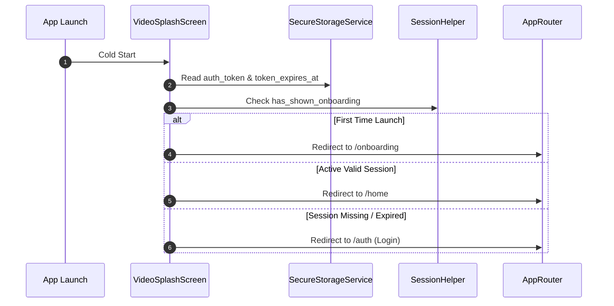

# Splash & Bootstrapping Module Documentation

> **[🏠 Root README](../README.md) • [📚 Docs Hub](./README.md) • [🗺️ Architecture Flow](./project_architecture_and_flow.md) • [🚀 Open Interactive Portal](./index.html)**
> **Note:** These pages are specifically for **Developer Documentations**.

---

---

## 1. Overview & Business Context

- **Purpose:** Manages the cold-start initialization sequence, in-app update checks, desktop window centering, and authentication token evaluation to resolve routing to Onboarding, Login, or the Home Dashboard.
- **Access Boundaries:** Public gateway.
- **Supported Platforms:** Android, iOS, macOS, Windows, Linux, and Web.

---

---

## 2. End-to-End Module Flow & State Lifecycle

### 2.1 User Journey & Step-by-Step UI Flow

1. **Entry Trigger:** Application launch / process start. Initial entry point at `/splash`.
2. **Action / Interaction Steps:**
   - User sees animated brand logo and premium gold gradient background.
   - Bootstrapping engine checks app version, network, and token validity.
3. **Async / Background Processing:**
   - Evaluates `SecureStorageService.getAuthToken()`.
   - Checks `SessionHelper.has_shown_onboarding`.
4. **Outcome Branches:**
   - **First Launch:** Redirects to `/onboarding`.
   - **Active Session:** Redirects to `/home`.
   - **Expired / No Token:** Redirects to `/auth` (Login).
5. **Exit / Terminal Route:** Navigates to resolved target route.

### 2.2 Architectural Sequence / Flow Diagram

---

---

## 3. Architecture & Code Structure

- **File Layout:**
  - `screens/`: `video_splash.screen.dart`
  - `widgets/`: `splash_components.widget.dart`
  - Root module barrel: `splash.dart`
- **Core Dependencies:** Injected `SecureStorageService`, `SessionHelper`, `UpdateService`.

---

---

## 4. State Management (BLoC / Cubit)

- **Controller Strategy:** Simple asynchronous initialization future with routing trigger.

---

---

## 5. API & Data Layer Contracts

- **Endpoints:** Optional update check `/api/app-version`.
- **Repository Interface & Implementation:** Storage inspection contracts.

---

---

## 6. UI, Design Tokens & Mandatory Assets

- **Asset Registry:** Generated logo graphics via `Assets.images.*`.
- **Core Widget Reusability:** Standardized on `RootScaffold`.
- **Design Tokens & Theme Palette Switch (`lib/core/theme/`):** All splash screen components strictly import design system tokens from `lib/core/theme/theme.dart` as defined in the [Theme & Responsive System User Manual](./theme_and_responsive_system.md). All UI components bind colors dynamically via `context.colors` (`context.colors.card`, `context.colors.textPrimary`, `context.colors.cardBorder`, `context.colors.primary`), typography via `AppTextStyles`, spacing via `AppSpacing.*Responsive` or `context.screenPadding`, radii via `AppBorderRadius.*Responsive`, and shadows via `AppShadows.card(isDark: context.isDark)`. This guarantees dynamic palette skinning across SASS brand presets (`goldLuxury`, `fintechBlue`, `emerald`, `corporateIndigo`) via `AppThemeConfig` and automatic light/dark mode adaptation without hardcoded color overrides.

---

---

## 7. Multi-Platform & Error Handling Strategy

- **Platform Handling:** Desktop initializes `window_manager` to position window at screen center and suppress white flash during engine boot.
- **Failure Matrix:** Corrupted storage defaults safely to login screen.

---

---

## 8. Verification & Test Suite

- Unit test suite at `test/modules/splash/`.

---

---

### 🧭 Module Navigation

|                      ⬅️ Previous Module                      |        🏠 Documentation Hub         |                ➡️ Next Module                |
| :---

----------------------------------------------------------: | :---------------------------------: | :------------------------------------------: |
| [⬅️ Design System & Theme](./theme_and_responsive_system.md) | **[📚 Connected Hub](./README.md)** | [Onboarding Walkthrough ➡️](./onboarding.md) |

## 9. Quality Enforcement
- Koi bhi feature PR / commit tab tak pass nahi mana jayega jab tak uske flow diagrams aur step-by-step user journey documentation `docs/developer_docs/[feature_name].md` me update na ho chuki ho.
