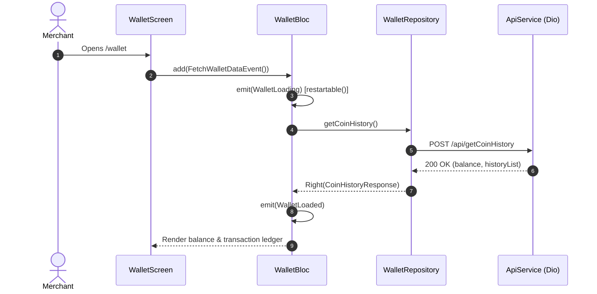

# Virtual Wallet & FP Coins Module Documentation

> **[🏠 Root README](../README.md) • [📚 Docs Hub](./README.md) • [🗺️ Architecture Flow](./project_architecture_and_flow.md) • [🚀 Open Interactive Portal](./index.html)**
> **Note:** These pages are specifically for **Developer Documentations**.

---

---

## 1. Overview & Business Context

- **Purpose:** Manages the platform's virtual coin economy (FP Coins). Merchants use coins to unlock credit scores, configure mandates, and access premium underwriting features. Governs real-time balance tracking, purchase packages, and transaction ledgers.
- **Access Boundaries:** Authenticated users (`AuthAuthenticated`).
- **Supported Platforms:** Mobile, Tablet, Desktop, and Web.

---

---

## 2. End-to-End Module Flow & State Lifecycle

### 2.1 User Journey & Step-by-Step UI Flow

1. **Entry Trigger:** User navigates to "Wallet" tab via bottom navigation or desktop sidebar.
2. **Action / Interaction Steps:**
   - User reviews available coin balance and active bonus rules.
   - User filters coin history (All, Purchase, Spent, Bonus) or selects custom dates.
   - User taps "Buy Coins" to open payment package bottom sheet.
   - User completes checkout via payment gateway.
3. **Async / Background Processing:**
   - `WalletCubit.fetchWalletData()` fetches balance and historical ledger.
   - Paginated transaction requests load incrementally.
4. **Outcome Branches:**
   - **Happy Path:** Balance updates with celebratory haptics and bonus coin animation.
   - **Failure Path:** Network drop displays offline message and cached ledger.
5. **Exit / Terminal Route:** Navigates back or switches tabs.

### 2.2 Architectural Sequence / Flow Diagram

---

---

## 3. Architecture & Code Structure

- **File Layout:**
  - `cubit/`: `wallet.bloc.dart`, `wallet.event.dart`, `wallet.state.dart`
  - `models/`: `bonus_rule.model.dart`, `coin_history.model.dart`
  - `data/`: `wallet.repository.dart`
  - `screens/`: `wallet.screen.dart`
  - `widgets/`:
    - `wallet_history_mobile_list.widget.dart`, `wallet_history_desktop_list.widget.dart`
    - `wallet_history_header.widget.dart`, `wallet_history_empty_state.widget.dart`
    - `buy_coins.widget.dart`, `wallet_date_filter.widget.dart`
- **Core Dependencies:** Injected via `locator<WalletRepository>()`.

---

---

## 4. State Management (BLoC / Cubit)

- **Controller Name:** `WalletBloc`.
- **Concurrency Transformers:**
  - `restartable()`: Applied to `FetchWalletDataEvent`, `FetchCoinHistoryEvent`, `ApplyWalletFilterEvent`, and `ApplyWalletDateFilterEvent` so fast user filter clicks discard stale HTTP responses.
  - `droppable()`: Applied to `CreateCoinOrderEvent`, `VerifyCoinPaymentEvent`, `ExportCoinHistoryEvent`, and `LoadMoreMobileWalletHistoryEvent` to prevent duplicate orders/payments and scroll load-more spikes.
- **States:** Sealed hierarchy (`WalletInitial`, `WalletLoading`, `WalletLoaded`, `WalletError`).

---

---

## 5. API & Data Layer Contracts

- **Endpoints:**
  - `POST /api/getCoinHistory`: Paginated wallet transactions. Accepts complex filter payloads.
  - `GET /api/wallet/balance`: Instant balance polling.
- **Filter Parameters Contract (`CoinHistoryRequest`):**
  - `type` / `filterType`: Enum representation (`CoinTransactionType.all`, `CoinTransactionType.credit`, `CoinTransactionType.debit`).
  - `date_filter`: Enum string (`'none'`, `'today'`, `'yesterday'`, `'this_week'`, `'this_month'`, `'custom'`).
  - `from_date` / `to_date`: `YYYY-MM-DD` formatted dates (required only when `date_filter` is `'custom'`).
- **Repository Interface & Implementation:** Standardized non-throwing contracts returning `TaskEither<ApiFailure, T>`.

---

---

## 6. UI, Design Tokens & Mandatory Assets

- **Asset Registry:** Generated coin icons via `Assets.*`.
- **Core Widget Reusability:** Standardized on `RootScaffold`, `CustomAppBar`, `PrimaryButton`, `ExportSelectionDialog`.
- **Design Tokens & Theme Palette Switch (`lib/core/theme/`):** All wallet elements and sub-widgets strictly import design system tokens from `lib/core/theme/theme.dart` as defined in the [Theme & Responsive System User Manual](./theme_and_responsive_system.md). All UI components bind colors dynamically via `context.colors` (`context.colors.card`, `context.colors.textPrimary`, `context.colors.cardBorder`, `context.colors.primary`), typography via `AppTextStyles`, spacing via `AppSpacing.*Responsive` or `context.screenPadding`, radii via `AppBorderRadius.*Responsive`, and shadows via `AppShadows.card(isDark: context.isDark)`. This guarantees dynamic palette skinning across SASS brand presets (`goldLuxury`, `fintechBlue`, `emerald`, `corporateIndigo`) via `AppThemeConfig` and automatic light/dark mode adaptation without hardcoded color overrides.

---

---

## 7. Multi-Platform & Error Handling Strategy

- **Platform Handling:** Mobile features swipe-to-copy transaction IDs; Desktop renders unified `DesktopDataTable` instances with bulk export actions, dynamic constraints, and scrolling handling.
- **Failure Matrix:** Payment verification delays trigger status polling without blocking navigation.

---

---

## 8. Verification & Test Suite

- Unit test suite at `test/modules/wallet/`.

---

---

### 🧭 Module Navigation

|               ⬅️ Previous Module                |        🏠 Documentation Hub         |              ➡️ Next Module              |
| :---

---------------------------------------------: | :---------------------------------: | :--------------------------------------: |
| [⬅️ Credit Score Assessment](./credit_score.md) | **[📚 Connected Hub](./README.md)** | [Analytics & Reports ➡️](./analytics.md) |

## 9. Quality Enforcement
- Koi bhi feature PR / commit tab tak pass nahi mana jayega jab tak uske flow diagrams aur step-by-step user journey documentation `docs/developer_docs/[feature_name].md` me update na ho chuki ho.
