# 📊 Analytics Module QA Documentation

[⬅️ Back to Main](../README.md) | [📚 Developer Docs](../developer_docs/analytics.md)

## 🗺️ User Journey Flow

```mermaid
flowchart TD
    A["Open Analytics Screen"] --> B["Fetch Data"]
    B --> C{"API Success?"}
    C -- Yes --> D["Render Interactive Charts"]
    C -- No --> E["Show Soft Warning + Cached/Mock Data"]
    
    D --> F["Change Timeframe"]
    F --> G["Cancel Pending & Refetch Data"]
    D --> H["Tap Metric Filter"]
    H --> I["Update Chart Lines"]
    
    D --> J["Tap Export Icon"]
    J --> K["Select CSV/PDF"]
    K --> L["Generate File & Open Share Sheet"]
```

---

## 🎯 Input Cheat Sheet: Correct vs Wrong

### Custom Date Range Picker

| Input | Result | Status |
| :--- | :--- | :--- |
| `2024-03-01` to `2024-03-15` | Valid range parsed to `yyyy-MM-dd` | ✅ |
| `03/01/2024` | Invalid format for API payload | ❌ |

### Export File Generation

| Input Format | Expected Outcome | Status |
| :--- | :--- | :--- |
| `csv` | Generates tabular `.csv` | ✅ |
| `pdf` | Generates formatted `.pdf` | ✅ |
| `docx` | Unsupported format | ❌ |

---

## 🧪 Test Cases

### 1. Dashboard State Transitions

| Action | Expected Result |
| :--- | :--- |
| **Open Analytics Screen** | Status `loading` -> Shimmer loaders displayed |
| **API Success** | Status `success` -> Charts populate smoothly with animations |
| **API Failure (500 or timeout)** | Status `error` -> Shows warning snackbar, but gracefully renders Mock Fallback data |

### 2. Timeline Selector

| Action | Expected Result |
| :--- | :--- |
| **Tap "This Month"** | Payload `period='thisMonth'`, refetches data. |
| **Tap multiple timelines fast** | `restartable()` cancels stale requests and only final request completes |
| **Tap "Custom"** | Opens native date picker. Selecting range sets `period='custom'`, refetches with `from_date` and `to_date` |

### 3. Metric Interactions

| Action | Expected Result |
| :--- | :--- |
| **Hover/Touch chart data point** | Displays localized floating tooltip (Date, Amount, Debit Count) |
| **Tap 'Failed Payments' pill** | Chart filters to show bounced/failed metrics |

### 4. Export Flow

| Action | Expected Result |
| :--- | :--- |
| **Tap Export > CSV** | Shows loading, triggers ExportService, opens share sheet with `analytics_period.csv` |
| **Tap Export > PDF** | Shows loading, triggers ExportService, opens share sheet with formatted PDF |
| **Tap Export rapidly** | `droppable()` prevents duplicate exports while one is processing |

---

## 🚨 Edge Cases & Boundaries

- **No Internet:** API throws `ApiFailure.network`. BLoC logs warning, screen does NOT crash, and instead loads offline mock charts so user can still see structure.
- **Empty Custom Date:** Submitting custom date without bounds shows Error snackbar.
- **Session Expiration:** Triggers 401 interceptor and returns to Login.
- **Zero Target Amount:** Success rate calculation `(paid / target) * 100` prevents Divide by Zero by returning `0.00`.
