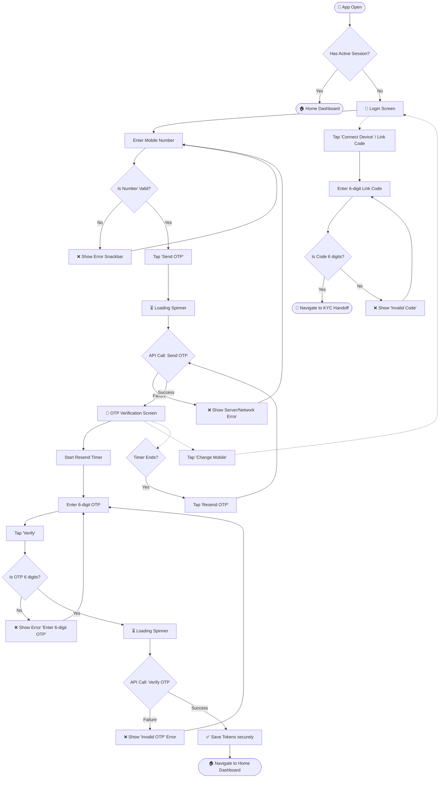

# 🛡️ QA Test Documentation: Authentication Module

Welcome to the QA Guide for the **Auth Module**! This document will help you test the login, OTP verification, and policy agreement flows step-by-step.

---

## 🗺️ 1. User Journey Flowchart

---

## 🎯 2. Input Cheat Sheet: Correct vs Wrong

Here are the strict rules the app uses to validate inputs before even talking to the server.

### 📱 Mobile Number Rules

- **For India (IN), US, Canada (CA):** Exactly **10 digits**.
- **For UK (GB):** Exactly **11 digits**.
- **For Others:** Up to **15 digits**.
- **Only Numbers allowed!**

| Input Type | Value | Pass/Fail | Reason |
| :--- | :--- | :---: | :--- |
| ✅ **Correct** (IN) | `9876543210` | ✅ | Exactly 10 digits |
| ❌ **Wrong** (IN) | `987654321` | ❌ | Only 9 digits (Too short) |
| ❌ **Wrong** (IN) | `98765432101` | ❌ | 11 digits (Too long, UI won't allow typing) |
| ❌ **Wrong** (Any) | *(Empty)* | ❌ | Cannot be blank |

### 🔑 OTP & Link Code Rules

- Must be exactly **6 digits**.

| Input Type | Value | Pass/Fail | Reason |
| :--- | :--- | :---: | :--- |
| ✅ **Correct** | `123456` | ✅ | Exactly 6 digits |
| ❌ **Wrong** | `12345` | ❌ | Only 5 digits |
| ❌ **Wrong** | *(Empty)* | ❌ | Cannot be blank |

---

## 🧪 3. Test Cases

### 🛠️ TC01: Empty Mobile Number Submission

| Step | Action | Expected Result |
| :--- | :--- | :--- |
| 1 | Open Login Screen | Mobile field is empty |
| 2 | Tap "Send OTP" without typing anything | ❌ Error Snackbar appears: "Please enter mobile number" |

### 🛠️ TC02: Invalid Mobile Length (India)

| Step | Action | Expected Result |
| :--- | :--- | :--- |
| 1 | Select India (+91) country code | Flag changes to India |
| 2 | Enter `99999` (5 digits) | Field accepts 5 digits |
| 3 | Tap "Send OTP" | ❌ Error Snackbar appears: "Please enter a valid 10-digit mobile number" |

### 🛠️ TC03: Successful OTP Request (Happy Path)

| Step | Action | Expected Result |
| :--- | :--- | :--- |
| 1 | Enter a valid 10-digit mobile number | Number is entered |
| 2 | Tap "Send OTP" | ⏳ Button shows loading state momentarily |
| 3 | Wait for API response | ✅ Screen transitions to OTP Verification. Resend timer starts counting down. Success Snackbar appears. |

### 🛠️ TC04: Invalid OTP Submission

| Step | Action | Expected Result |
| :--- | :--- | :--- |
| 1 | On OTP screen, enter `12345` (5 digits) | OTP field filled partially |
| 2 | Tap "Verify" | ❌ Error Snackbar appears: "Please enter a valid 6-digit OTP" |

### 🛠️ TC05: Change Mobile Number Flow

| Step | Action | Expected Result |
| :--- | :--- | :--- |
| 1 | On OTP screen, tap "Change Mobile" | ✅ Transitions back to the mobile entry screen. OTP field is cleared. Timer resets. |

### 🛠️ TC06: Resend OTP Flow

| Step | Action | Expected Result |
| :--- | :--- | :--- |
| 1 | Wait for the countdown timer to reach `00:00` | "Resend OTP" text becomes clickable |
| 2 | Tap "Resend" | ⏳ Loading state. A new OTP is sent. Timer restarts. |

### 🛠️ TC07: Link Code (Device Connection)

| Step | Action | Expected Result |
| :--- | :--- | :--- |
| 1 | Tap the link code option / drawer | Link code dialog appears |
| 2 | Enter `1234` and tap Connect | ❌ Error Snackbar: "Please enter 6 digit code" |
| 3 | Enter `999999` and tap Connect | ✅ Dialog closes, navigates to KYC Handoff |

### 🛠️ TC08: Back Button Guard (Leaving App)

| Step | Action | Expected Result |
| :--- | :--- | :--- |
| 1 | On Login Screen, trigger Android Back button | A confirmation dialog appears asking if you want to leave |
| 2 | Tap "Stay" | Dialog closes, app remains open |
| 3 | Tap "Exit" | App closes |

---

## 🌩️ 4. Edge Cases (The "What Ifs")

1. **What if the phone has NO INTERNET when clicking Send OTP?**
   - **Expected:** The loading spinner spins briefly, then an Error Snackbar appears saying "Connection Failed" (or similar API failure message). User stays on the mobile input screen.

2. **What if the Server is DOWN (500 Error)?**
   - **Expected:** Loading spinner stops, and a red Error Snackbar shows the server error message (e.g., "Failed to send OTP").

3. **What if the user enters the WRONG OTP?**
   - **Expected:** The server returns an error. A red Error Snackbar appears ("Invalid OTP"). The user stays on the OTP screen and can try again.

4. **What if the Keyboard covers the buttons?**
   - **Expected:** The screen is scrollable. Branding footers automatically hide themselves so the text field and "Send OTP" button are always visible.

---

## 🔄 5. Behind the Scenes (State Transitions)

For QA testers communicating with developers, here is exactly how the app's brain (`LoginBloc`) moves from one state to another:

- **Initial State:** `LoginInitialState`
- **When user taps Send OTP / Verify:** Moves to `LoginLoadingState` (shows loading overlays).
- **If Send OTP succeeds:** Moves to `OtpSentSuccessState` (switches UI to OTP form).
- **If Verify OTP succeeds:** Moves to `LoginSuccessState` (saves tokens secretly to secure storage, fires `UserLoggedInEvent`, and navigates to Home).
- **If ANY API call fails:** Moves to `LoginFailedState` (hides loader, shows Error Snackbar).
