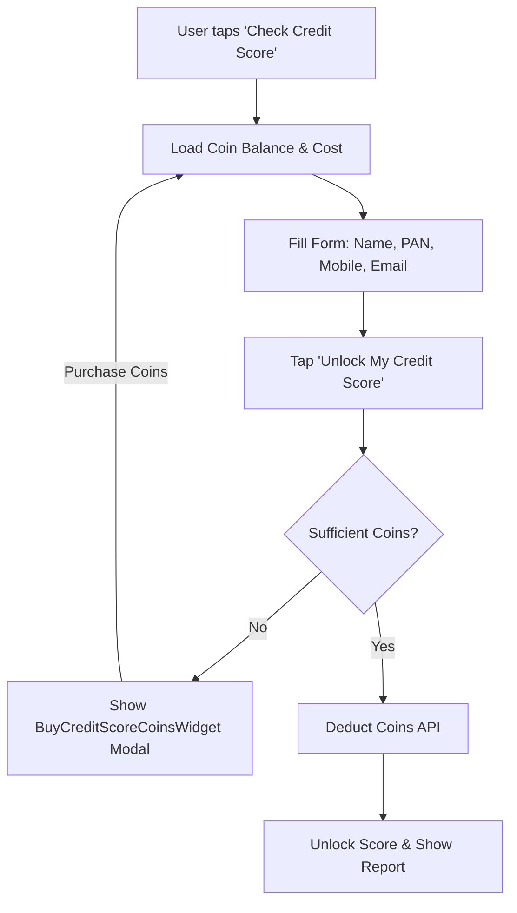
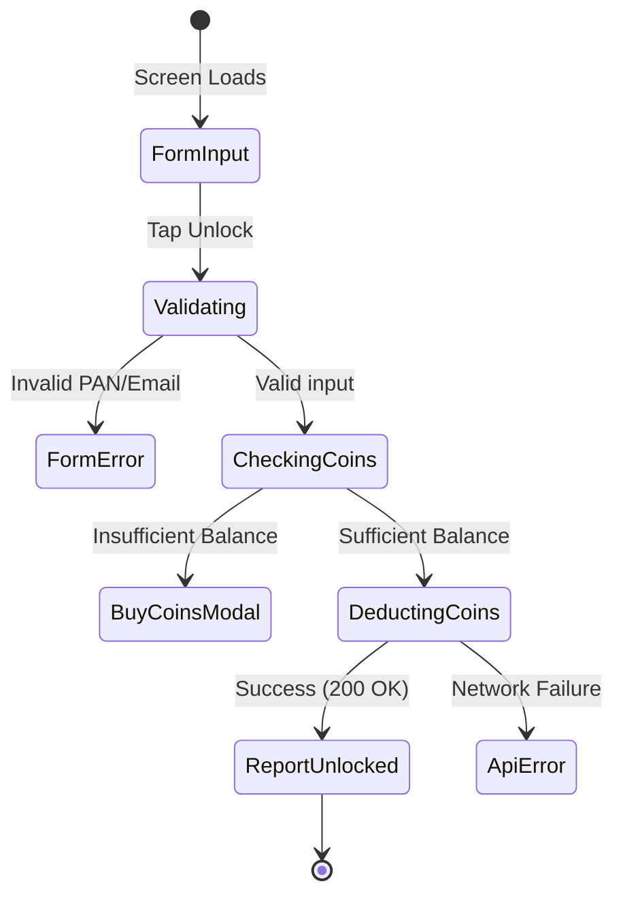

# 📈 Credit Score Module - QA Test Documentation

> **[🏠 Back to QA Docs Hub](./README.md)**

---

## 🗺️ User Journey Flow

## 🧪 Test Cases

### 📋 Form Validation

| Action | Expected Result |
| -------- | ---------------- |
| Enter valid name (as on PAN) | Field accepts input |
| Enter valid Email | Validation passes |
| Enter invalid Email (e.g., `test.com`) | Shows regex validation error |
| Enter valid PAN (10 chars) | Validation passes |
| Enter invalid PAN | Shows regex validation error |
| Enter valid mobile number | Validation passes |

### 💰 Coin Verification & Unlock

| Action | Expected Result |
| -------- | ---------------- |
| View screen | Top app bar displays current coin balance & unlock cost |
| Tap 'Unlock' with sufficient coins | Coins deducted, shows success snackbar, loads report |
| Tap 'Unlock' with insufficient coins | Opens BuyCreditScoreCoinsWidget bottom sheet |
| Complete coin purchase in modal | Balance updates, allows unlock action again |

---

## 🎯 Input Cheat Sheet: Correct vs Wrong

| Field | ✅ Correct | ❌ Wrong | Reason |
|-------|------------|----------|--------|
| **Email** | `test@example.com` | `test@example` | Must match `^[^@]+@[^@]+\.[^@]+$` |
| **PAN** | `ABCDE1234F` | `12345ABCDE` | Must match valid PAN format |

---

## ⚠️ Edge Cases

| Scenario | Expected Result |
| ---------- | ---------------- |
| **No Internet Connection** | Semantic snackbar shows network disconnect, form input is preserved |
| **Server Down on Deduct** | Shows retry prompt, coins are NOT deducted locally |
| **Empty States (0 Coins)** | Balance API returns 0 -> smoothly handled as insufficient balance |

---

## 🔄 State Transitions

