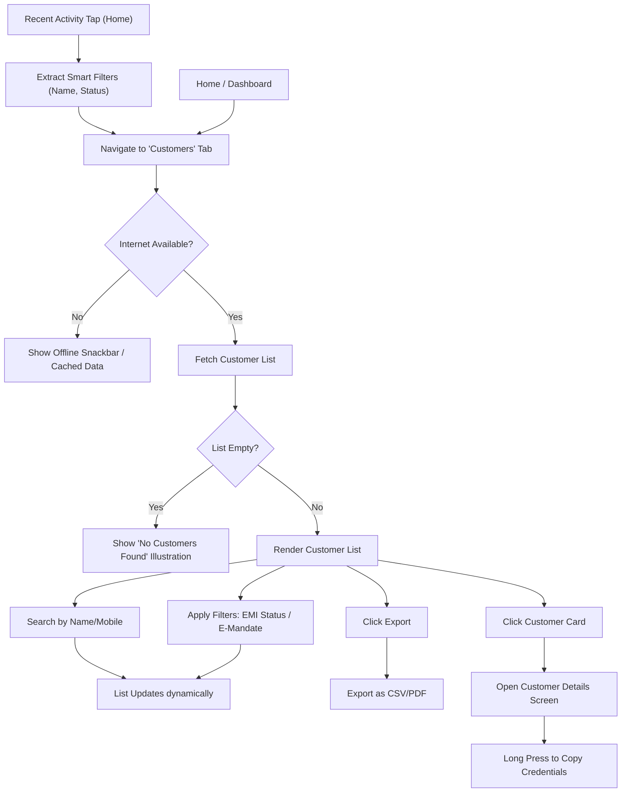

# 🧑‍💼 Customer Management Module - QA Documentation

> **[🏠 Root README](../../README.md) • [📚 Docs Hub](../developer_docs/README.md)**

---

## 🎯 1. Overview & Goal

This module allows merchants to manage their customers. The user can view a list of customers, search/filter them, view detailed profiles, and export data. It handles both Desktop and Mobile layouts differently.

---

## 🗺️ 2. User Journey Flowchart

---

## 🔄 3. BLoC State Transitions

These are the backend states the app cycles through. Use this to understand loading behaviors.

| Start State | Trigger Event | Next State | QA Check |
| :--- | :--- | :--- | :--- |
| `CustomerInitial` | `LoadCustomersEvent` | `CustomerLoading` | Skeleton loaders should appear. |
| `CustomerLoading` | *API Success* | `CustomerLoaded` | Customer list appears without scrolling issues. |
| `CustomerLoading` | *API Failure* | `CustomerError` | Error message displayed; retry option available. |
| `CustomerLoaded` | `SearchCustomersEvent` | `CustomerLoading` -> `CustomerLoaded` | Debounced search triggers loaders temporarily, then updates list. |
| `CustomerLoaded` | `ApplyServerFilterEvent` | `CustomerLoading` -> `CustomerLoaded` | Filters update correctly and persist across network updates. |
| `CustomerLoaded` | `ExportCustomerListEvent` | *(No state change)* | Export triggers file generation without blocking UI. |

---

## 🧪 4. Test Cases

### 4.1 Phone Number & Search Validations

*Note: The code cleans phone numbers using `phone.replaceAll(RegExp(r'[^\d+]'), '')`.*

| Test Case | Action | Expected Result |
| :--- | :--- | :--- |
| **Search by Clean Phone** | Type `9876543210` in search. | Shows customers matching the phone number. |
| **Search by Formatted Phone** | Type `+91 98765-43210` in search. | Special chars stripped. Resolves same as `+919876543210`. |
| **Search by Invalid Chars** | Type `abc@#$` in phone search. | Input ignored or stripped. Empty search. |
| **Search by Name** | Type partial name (e.g., `Rahul`). | Returns all customers with `Rahul` in their name. |

### 4.2 Smart Filters / External Navigation Payloads

| Test Case | Action | Expected Result |
| :--- | :--- | :--- |
| **Arrive from Recent Activity (Mandate)** | Tap "Mandate created for Ravi" on Home. | Navigates here. Search box shows `Ravi`. E-Mandate filter auto-set to `Active`. |
| **Arrive from Recent Activity (EMI)** | Tap "EMI overdue for Anjali" on Home. | Navigates here. Search box shows `Anjali`. EMI filter auto-set to `Overdue`. |
| **Unwrap Nested Router Payload** | Router passes `{initialFilters: {name: "Anjali"}}`. | Code correctly unwraps payload, populates search bar, and fires server event automatically without user input. |

### 4.3 Platform Layouts (Mobile vs Desktop)

| Test Case | Action | Expected Result |
| :--- | :--- | :--- |
| **Desktop List View** | Open app on Desktop/Web and resize window > 800px. | Shows data table format with columns (Name, Mobile, Status, etc.). |
| **Mobile List View** | Open app on Mobile or resize window < 800px. | Shows vertical list of swipeable cards. |
| **Desktop Pagination** | Click pagination controls `< 1 2 3 >` on desktop. | Navigates between pages smoothly. |
| **Mobile Scrolling** | Scroll to bottom of mobile list. | Triggers infinite scroll (loads more). |

### 4.4 Comprehensive Filtering (Date, E-Mandate, EMI)

*Note: Filters can be stacked. E.g., Search = "Rahul" + EMI = "Overdue" + Date = "This Month".*

| Test Case | Action | Expected Result |
| :--- | :--- | :--- |
| **Filter by E-Mandate Status (Active)** | Toggle E-Mandate filter to `Active`. | List strictly shows users with active mandates. API payload: `emandate_status = 'active'`. |
| **Filter by E-Mandate Status (Failed)** | Toggle E-Mandate filter to `Failed`. | List strictly shows users with failed mandates. API payload: `emandate_status = 'failed'`. |
| **Filter by EMI Status (Upcoming)** | Toggle EMI filter to `Upcoming`. | List strictly shows users with upcoming EMIs. API payload: `emi_status = 'upcoming'`. |
| **Filter by EMI Status (Overdue)** | Toggle EMI filter to `Overdue`. | List strictly shows users with overdue EMIs. API payload: `emi_status = 'overdue'`. |
| **Filter by EMI Status (Paid)** | Toggle EMI filter to `Paid`. | List strictly shows users with paid EMIs. API payload: `emi_status = 'paid'`. |
| **Date Range: Preset (This Week)** | Toggle Date filter to `This Week`. | Results bounded from Monday to Sunday of the current week. API payload: `date_filter = 'this_week'`. |
| **Date Range: Custom (Picker)** | Select `Custom` and pick a valid start/end date range. | Results strictly constrained to selected dates. API payload sends `date_filter = 'custom'`, `from_date = 'YYYY-MM-DD'`, `to_date = 'YYYY-MM-DD'`. |
| **Stacking Filters (Multiple)** | Type `John` in search, select `Overdue` EMI, select `Today`. | Strict intersection applied. Only shows John IF he has an overdue EMI today. |
| **Clear All Filters** | Click "Clear" or "All" on filter pills. | All customers appear again. API sends empty strings for status parameters. |

### 4.5 Details & Export Functionality

| Test Case | Action | Expected Result |
| :--- | :--- | :--- |
| **View Details** | Tap/Click on a customer card. | Opens Customer Profile view. |
| **Copy Details** | Long press on Phone number or Registration No. | Text copied to clipboard. (Feedback shown). |
| **Export to CSV** | Click Export -> Select CSV. | Downloads `.csv` file with correctly formatted headers and data. |
| **Export to PDF** | Click Export -> Select PDF. | Generates and downloads a `.pdf` document of the list. |

---

## ⚠️ 5. Edge Cases & Error Handling

| Scenario | Action to reproduce | Expected Behavior |
| :--- | :--- | :--- |
| **No Internet Connection** | Turn off WiFi/Data -> Open Customers. | Shows offline snackbar. Loads cached data if available. |
| **API Server Down (500 Error)** | Force 500 server error on API. | Shows user-friendly error: "Something went wrong. Please try again." |
| **Empty Customer List** | Login as a brand new merchant. | Shows localized "No customers found" empty state illustration. |
| **Empty Search Result** | Type `ZzZzZzZ` in search. | Shows "No matching customers found." |
| **Export Very Large List** | Export a list with 10k+ records. | Shows loading indicator; App does NOT freeze. |

---

## 🎯 6. Input Cheat Sheet: Correct vs Wrong

| Scenario | ✅ Correct Input | ❌ Wrong Input / Behavior |
| :--- | :--- | :--- |
| **Phone Search** | `9876543210` or `+919876543210` | `987` (too short), `abc987` (letters ignored) |
| **Name Search** | `John Doe` | `J@hn D0e` (unless specifically typed that way in DB) |
| **Export** | Standard tap, wait for download. | Double-tapping rapidly (Prevented by `droppable()` in BLoC). |
