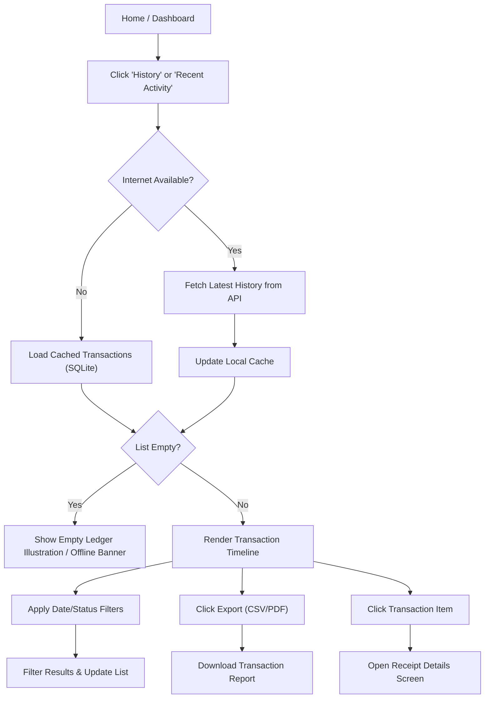

# 📜 Transaction History Module - QA Documentation

> **[🏠 Root README](../../README.md) • [📚 Docs Hub](../developer_docs/README.md)**

---

## 🎯 1. Overview & Goal
This module provides a chronological audit ledger of digital mandate debit events, settlements, and customer transaction records. Users can filter by date/status, and export records. The module uses SQLite for offline caching.

---

## 🗺️ 2. User Journey Flowchart

---

## 🔄 3. BLoC State Transitions

These are the backend states the app cycles through. Use this to understand loading behaviors.

| Start State | Trigger Event | Next State | QA Check |
| :--- | :--- | :--- | :--- |
| `HistoryInitial` | `LoadHistoryEvent` | `HistoryLoading` | Shimmer loaders appear while fetching. |
| `HistoryLoading` | *Cache Loaded* | `HistoryLoaded (Offline)` | Immediate display of local SQLite records. |
| `HistoryLoading` | *API Success* | `HistoryLoaded` | Fresh data replaces cached data. List updates seamlessly. |
| `HistoryLoading` | *API Failure* | `HistoryError` | Error state displayed (if no cache exists), else offline banner. |
| `HistoryLoaded` | `FilterHistoryEvent` | `HistoryLoading` -> `HistoryLoaded` | Re-fetches or filters list based on date/status. |
| `HistoryLoaded` | `LoadMoreTransactions` | `HistoryLoadingMore` -> `HistoryLoaded` | Pagination fetches older records when scrolling down. |

---

## 🧪 4. Test Cases

### 4.1 Transaction List & Pagination

| Test Case | Action | Expected Result |
| :--- | :--- | :--- |
| **Initial Load** | Open History tab. | Displays transaction list. Shows shimmer loading initially. |
| **Pagination (Mobile)** | Scroll to bottom of list. | Infinite scroll loads older transactions automatically. |
| **Pagination (Desktop)** | Click next page on data grid. | Loads the next set of transactions smoothly. |

### 4.2 Date & Status Filters

| Test Case | Action | Expected Result |
| :--- | :--- | :--- |
| **Status Filter: Success** | Select "Success" from status filter. | Only successful debits are listed. |
| **Status Filter: Failed** | Select "Failed" from status filter. | Only failed debits/transactions are listed. |
| **Date Range Filter** | Select start and end dates (e.g., Last 7 Days). | List updates to show records strictly within that range. |

### 4.3 Export Functionality

| Test Case | Action | Expected Result |
| :--- | :--- | :--- |
| **Export to CSV** | Click Export -> Select CSV. | Downloads `.csv` file containing currently filtered records. |
| **Export to PDF** | Click Export -> Select PDF. | Downloads `.pdf` audit report. |

### 4.4 Details View

| Test Case | Action | Expected Result |
| :--- | :--- | :--- |
| **View Receipt** | Tap a transaction item. | Navigates to receipt detail screen showing exact amounts, time, and IDs. |

---

## ⚠️ 5. Edge Cases & Error Handling

| Scenario | Action to reproduce | Expected Behavior |
| :--- | :--- | :--- |
| **No Internet (With Cache)** | Turn off WiFi/Data. Open History. | Shows offline banner. Displays previous local SQLite cache records. |
| **No Internet (No Cache)** | Clear app data. Turn off WiFi. Open History. | Shows "No Network" empty state. |
| **Server Error** | Force 500 error from API. | Show offline banner + fallback to SQLite cache data if available. |
| **Empty Filter Results** | Apply filters that match 0 records. | Show "No transactions found" illustration. |
| **Rapid Filter Switching** | Toggle Success/Pending/Failed very fast. | Does not duplicate list or crash. Shows final selected state. |

---

## 🎯 6. Input Cheat Sheet: Correct vs Wrong

| Scenario | ✅ Correct Input | ❌ Wrong Input / Behavior |
| :--- | :--- | :--- |
| **Date Range** | `Start Date <= End Date` | `Start Date > End Date` (UI should prevent this selection) |
| **Pagination** | Scrolling smoothly. | Yanking scroll rapidly (Should debounce and not send 5 API requests). |
| **Export** | Standard tap, wait for download. | Double-tapping rapidly (Prevented by export bounds). |
