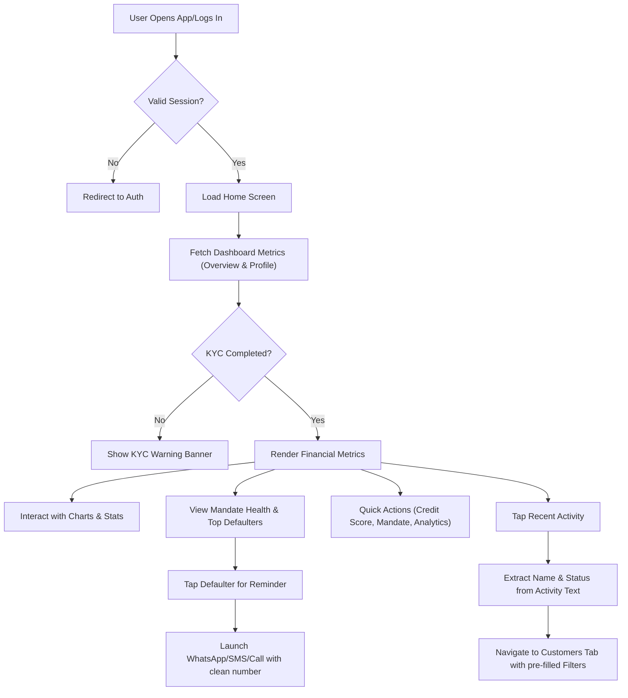

# 🏠 Home Dashboard Module QA Documentation

[⬅️ Back to Main](../README.md) | [📚 Developer Docs](../developer_docs/home.md)

## 🗺️ User Journey Flow

---

## 🎯 Input Cheat Sheet: Correct vs Wrong

### Announcement Slider HTML Stripping

| Input (Backend response) | Expected Render | Status |
| :--- | :--- | :--- |
| `Hello World` | `Hello World` | ✅ |
| `<b>Update</b>` | `Update` (bold styled by TagFlow) | ✅ |
| `` | Content stripped/rendered safely | ✅ |
| `\n\n\n\n\n` | `•` | ❌ |

### Top Defaulters Phone Cleaning

| Input Number | Cleaned Number | Status |
| :--- | :--- | :--- |
| `+91 98765-43210` | `+919876543210` | ✅ |
| `(987) 654 3210` | `9876543210` | ✅ |
| `not_a_number` | `` | ❌ |

### Cash in Hand Parsing

| Input String | Parsed Amount | Status |
| :--- | :--- | :--- |
| `₹ 1,250.50` | `1250.50` | ✅ |
| `Rs. 500` | `500` | ✅ |
| `No Cash` | `0.0` | ❌ |

---

## 🧪 Test Cases

### 1. Dashboard State Transitions & Rendering

| Action | Expected Result |
| :--- | :--- |
| **Open Home Screen** | Dashboard renders skeleton loader while fetching API (`HomeStatus.loading`) |
| **API Success (`HomeStatus.success`)** | Cards populate with actual data. Total collected, this month, outstanding display formatted text |
| **API Error (`HomeStatus.error`)** | Shows error message "dashboard_error_msg" and allows retry |
| **Pull to Refresh** | Discards stale in-flight requests, resets filters, reloads dashboard smoothly |

### 2. Conditional Cash Display

| Action | Expected Result |
| :--- | :--- |
| **Cash in hand > 0** | Shows the "Offline Cash Collected" widget with Handover CTA |
| **Cash in hand <= 0 or invalid** | Widget is completely hidden (SizedBox.shrink) |
| **Tap Handover CTA** | Triggers reconcile/handover action flow |

### 3. Top Defaulters List

| Action | Expected Result |
| :--- | :--- |
| **Empty list from API** | Shows "All mandates are on track 🎉" empty state |
| **Populated list** | Renders top 3 defaulters with rank colors (Red, Yellow, Blue) |
| **Tap Defaulter Card** | Navigates to `/customer_details` with `registration_no` |
| **Tap "Remind" Chip** | Opens Bottom Sheet with WhatsApp, SMS, Call options |

### 4. Communication Launchers

| Action | Expected Result |
| :--- | :--- |
| **Tap WhatsApp Reminder** | Opens WhatsApp with pre-filled encoded reminder text |
| **Tap SMS Reminder** | Opens SMS app with pre-filled text |
| **Tap Call Customer** | Opens Phone Dialer with cleaned number (no formatting chars) |
| **Invalid/Missing app** | Shows Snackbar error "Could not open..." |

### 5. Announcement Slider

| Action | Expected Result |
| :--- | :--- |
| **Empty announcement** | Widget is completely hidden |
| **Valid text** | Marquee scrolls RTL at 45pps with pulsing icon |
| **HTML tags in text** | Safely rendered using Tagflow plugin |

### 6. Recent Activity Smart Navigation

| Action | Expected Result |
| :--- | :--- |
| **Tap Activity "EMI overdue for Ankit"** | Opens Customer screen. Search = `Ankit`, EMI Status = `overdue` |
| **Tap Activity "Mandate created for Rahul"** | Opens Customer screen. Search = `Rahul`, E-Mandate Status = `active` |
| **Tap Activity "Coins deducted"** | Opens Wallet Tab |

### 7. Global User Info Reactivity (`UserInfoService`)

| Scenario | Expected UI Behaviour |
| :--- | :--- |
| **Initial Login / Fresh App Launch** | Both the Premium Side Drawer and the Top App Bar initially show a fallback (e.g., `Welcome` or phone number). |
| **Home Dashboard Fetches Profile** | The moment the `HomeBloc` finishes fetching the profile, the Drawer and App Bar reactively update to display the user's `fullname` (and verified `phone`). |
| **User Logs Out** | The `UserInfoService` is wiped. The next user to log in does not see the previous user's name cached in the UI before their own profile loads. |

---

## 🚨 Edge Cases & Boundaries

- **No Internet / Server Down:** State transitions to `HomeError`. App retains stale data if cached, or shows a non-blocking retry indicator.
- **Malformed Cash String:** E.g., `NaN` or `error` -> Regex `[^0-9.]` fails to parse, evaluates to `0.0`, and conditional cash module hides gracefully without crashing.
- **Top Defaulter Missing Name:** Fallbacks to `—`.
- **Top Defaulter Missing Amount:** Fallbacks to `0`.
- **Incomplete KYC Status:** `draftStepRealtime` correctly calculated based on profile completeness. Shows sticky KYC completion banner on top.
