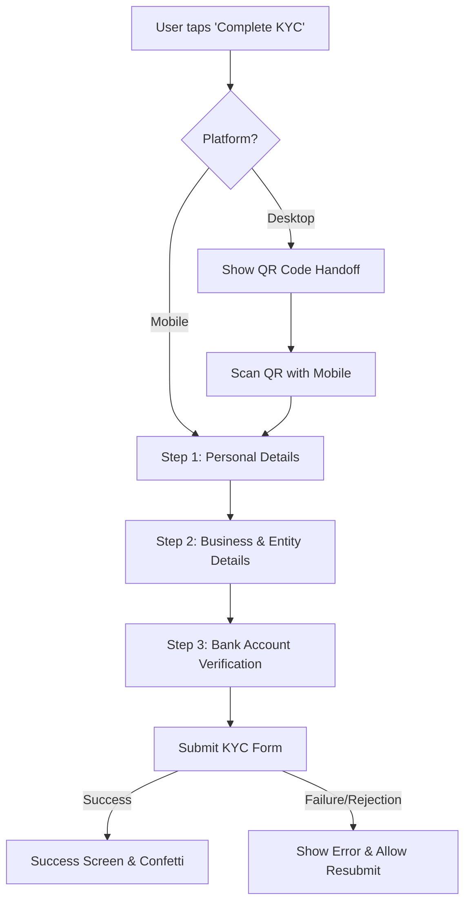
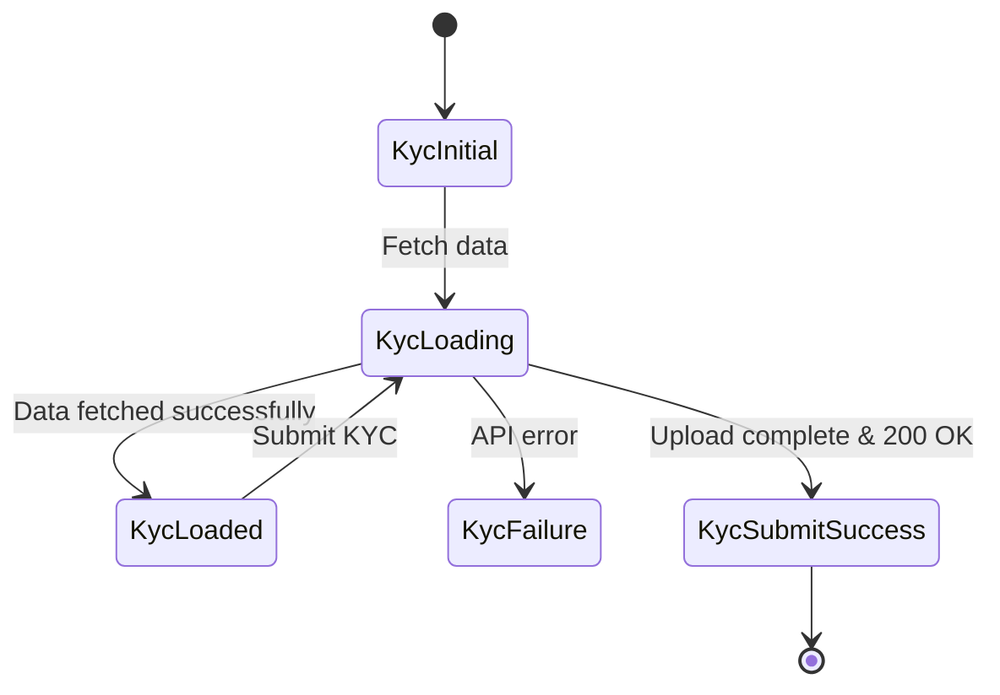

# 🛡️ KYC Verification Module - QA Test Documentation

> **[🏠 Back to QA Docs Hub](./README.md)**

---

## 🗺️ User Journey Flow

## 🧪 Test Cases

### 👤 Step 1: Personal Details

| Action | Expected Result |
| -------- | ---------------- |
| Enter valid name, phone, email & proceed | Moves to Step 2 |
| Enter invalid email (e.g., `user@.com`) | Shows validation error, blocks progress |
| Leave mandatory fields empty | Shows 'Required field' error on Submit |

### 🏢 Step 2: Business & Entity Details

| Action | Expected Result |
| -------- | ---------------- |
| Select "I don't have a business" | Skips mandatory entity registration docs |
| Enter valid PAN (e.g., ABCDE1234F) | Field auto-capitalizes (UpperCaseTextFormatter), validation passes |
| Enter invalid PAN (e.g., ABC123456) | Shows invalid PAN error |
| Select PAN as document | Prevents redundant document requests |
| Check dynamic business categories | Dropdown populates correctly from API |

### 🏦 Step 3: Bank Account & Submit

| Action | Expected Result |
| -------- | ---------------- |
| Enter valid IFSC (e.g., HDFC0123456) | Field auto-capitalizes (UpperCaseTextFormatter), validation passes |
| Enter invalid IFSC (e.g., HDFC1234567) | Shows invalid IFSC error (5th char must be 0) |
| Enter account number < 9 digits | Shows validation error |
| Enter account number > 18 digits | Shows validation error |
| Upload canceled cheque | File attaches successfully |
| Tap "Submit KYC" | Transitions to loading state, then success/failure |

### 💻 Desktop QR Handoff

| Action | Expected Result |
| -------- | ---------------- |
| Select KYC on Desktop | Displays QR code on screen |
| Scan QR with Mobile | Syncs session, allows mobile camera capture |

---

## 🎯 Input Cheat Sheet: Correct vs Wrong

| Field | ✅ Correct | ❌ Wrong | Reason |
| ------- | ------------ | ---------- | -------- |
| **Email** | `user@example.com` | `user@com` | Must match `^[\w-\.]+@([\w-]+\.)+[\w-]{2,4}$` |
| **PAN** | `ABCDE1234F` | `Abcde1234f` | Must be 10 uppercase alphanumeric `^[A-Z]{5}[0-9]{4}[A-Z]{1}$` |
| **IFSC** | `SBIN0123456` | `SBINO123456` | 5th character must be zero (0), `^[A-Z]{4}0[A-Z0-9]{6}$` |
| **Acc No.** | `123456789012` | `1234567` | Must be strictly between 9 and 18 digits |

---

## ⚠️ Edge Cases

| Scenario | Expected Result |
| ---------- | ---------------- |
| **No Internet Connection** | Shows network error banner/snackbar, prevents API call |
| **Server Down (500 Error)** | Displays generic failure message, allows retry |
| **Rapid Button Taps (Submit)** | API is only called once (event is droppable) |
| **Upload Timeout/Large File** | Shows file size limit breach/timeout error retry dialog |

---

## 🔄 State Transitions (KycBloc)

