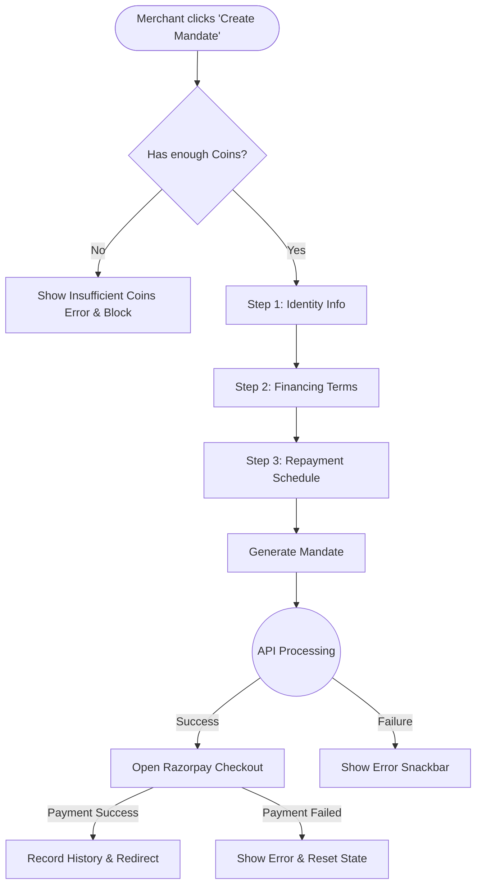

# 💳 QA Test Documentation: Mandate Checkout Module

> **[🏠 Root README](../README.md) • [💰 Wallet QA Doc](./qa_wallet.md)**

## 🌟 Overview
This document covers the **Mandate Checkout Module**, which handles the core monetization and subscription flow. Merchants use this to create and authorize recurring payment mandates (UPI AutoPay & e-NACH) with their customers.

---

## 🗺️ User Journey Flowchart

---

## 🧪 Test Cases (Action → Expected Result)

### 1️⃣ Step 1: Customer Identity
| Action | Expected Result |
| :--- | :--- |
| Click "Continue" without entering Full Name | **Validation Error:** "Required field" on Full Name. |
| Enter Full Name, leave Mobile empty | **Validation Error:** "Required field" on Mobile Number. |
| Enter Mobile with 9 digits and click Continue | **Validation Error:** Mobile must be exactly 10 digits. |
| Enter Mobile with non-numeric characters | **Input Blocked:** Field only accepts digits. |
| Enter valid Name + 10-digit Mobile | Moves to Step 2 smoothly. |

### 2️⃣ Step 2: Financing Terms
| Action | Expected Result |
| :--- | :--- |
| Leave Product Name blank | **Validation Error:** "Required field". |
| Leave Product Value blank | **Validation Error:** "Required field". |
| Enter letters in Product Value (e.g., `10abc`) | **Input Blocked:** Only positive decimals allowed. |
| Enter invalid decimal (e.g., `10..5`) | **Validation Error:** "Invalid amount format". |
| Click "Back" | Returns to Step 1 preserving entered data. |
| Enter valid details and click "Continue" | Moves to Step 3 smoothly. |

### 3️⃣ Step 3: Repayment Schedule & Submission
| Action | Expected Result |
| :--- | :--- |
| Select Frequency but leave Installments blank | **Validation Error:** "Required field". |
| Select a different Frequency | Installments dropdown resets and updates max allowed (e.g., 24 for months). |
| Enter Installments but no EMI Date | **Validation Error:** "Required field" on EMI Date. |
| Check Credit Days after entering info | Field should auto-calculate based on installments & frequency. |
| Leave Description blank | Submits fine (Optional field). |
| Click "Submit" with valid data | Opens Schedule Preview Dialog/BottomSheet. |
| Click "Confirm" on Schedule Preview | Verifies Coins, Deducts Coins, Submits API request. |
| Click "Back" | Returns to Step 2 preserving entered data. |

### 4️⃣ Checkout & Razorpay Gateway
| Action | Expected Result |
| :--- | :--- |
| Razorpay checkout opens & user completes payment | Success Snackbar, Records History, redirects to common screen. |
| Razorpay checkout opens & user cancels/fails | Error Snackbar shown, mandate state reset, stays on screen. |

---

## 🎯 Input Cheat Sheet: Correct vs Wrong

| Field | ✅ Correct Input | ❌ Wrong Input |
| :--- | :--- | :--- |
| **Mobile Number** | `9876543210` (10 digits) | `98765` (Too short), `98765432101` (Too long) |
| **Product Value** | `15000.50`, `5000` | `-5000` (Negative), `abc` (Text) |
| **Installments** | `12`, `6` | Empty |

---

## 🛑 Edge Cases & Boundary Testing

1. **No Internet Connection / Server Error:**
   - **Action:** Submit mandate with wifi turned off or server returning 500.
   - **Expected:** API call fails -> `MandateCheckoutFailure` -> Red Error Snackbar shown with failure message.
2. **Insufficient Coins:**
   - **Action:** Attempt to submit a mandate without enough wallet coins.
   - **Expected:** `CoinGateHelper` blocks submission and prompts user to recharge wallet.
3. **Empty / Null API Frequency Response:**
   - **Action:** Enter Step 3 while API fails to load frequencies.
   - **Expected:** Frequency dropdown says "Loading..." or shows an error state.
4. **Hardware Back Button / App Exit:**
   - **Action:** Press back button while in the middle of filling a form.
   - **Expected:** A Confirmation Dialog warns "Discard changes?". Prevents accidental data loss.

---

## 🔄 State Transitions (For QA Reference)

State flows from `MandateCheckoutBloc`:
1. `MandateCheckoutInitial` ➡️ `MandateCheckoutFrequenciesLoading` ➡️ `MandateCheckoutFrequenciesLoaded`
2. `SubmitCustomerDetailsEvent` ➡️ `MandateCheckoutLoading` (UI shows loader, blocks input)
3. API Success ➡️ `MandateCheckoutSuccess` (Opens Razorpay)
4. API Failure ➡️ `MandateCheckoutFailure` (Hides loader, shows Snackbar)
