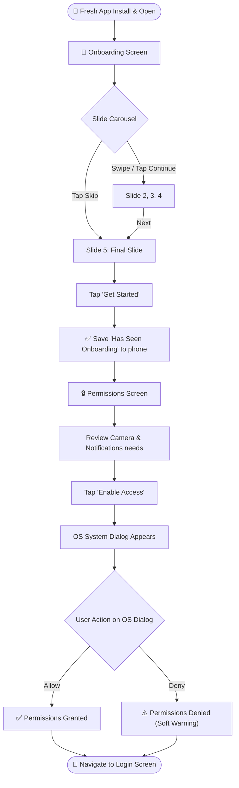

# 🚀 QA Test Documentation: Onboarding Module

Welcome to the QA Guide for the **Onboarding & Permissions Module**! This is the very first screen new users see when they install the app. It educates them and asks for necessary phone permissions.

---

## 🗺️ 1. User Journey Flowchart

---

## 🎯 2. Input Cheat Sheet: Correct vs Wrong

Unlike login forms, the onboarding flow has **no typing**. It is strictly a visual and interactive carousel. 

### Swipe & Navigation Rules
| Action | Valid? | Result |
| :--- | :---: | :--- |
| ✅ **Swipe Left on Slide 1** | ✅ | Moves to Slide 2 |
| ✅ **Tap "Continue"** | ✅ | Moves to next slide |
| ✅ **Tap "Skip"** | ✅ | Jumps straight to the final slide |
| ❌ **Swipe Right on Slide 1** | ❌ | Does nothing (already at beginning) |

---

## 🧪 3. Test Cases

### 🛠️ TC01: Standard Slide Navigation
| Step | Action | Expected Result |
| :--- | :--- | :--- |
| 1 | Launch fresh app | Onboarding Slide 1 is visible |
| 2 | Tap "Continue" | Carousel smoothly transitions to Slide 2 |
| 3 | Swipe left with finger | Carousel smoothly transitions to Slide 3 |

### 🛠️ TC02: Skip Functionality
| Step | Action | Expected Result |
| :--- | :--- | :--- |
| 1 | Launch fresh app | Onboarding Slide 1 is visible |
| 2 | Tap the "Skip" button | Carousel immediately jumps to the final slide (Slide 5) |

### 🛠️ TC03: Completing Onboarding
| Step | Action | Expected Result |
| :--- | :--- | :--- |
| 1 | Navigate to the final slide (Slide 5) | The button changes to "Get Started" |
| 2 | Tap "Get Started" | App smoothly navigates to the **Permissions Screen** |

### 🛠️ TC04: Permission Request Prompt
| Step | Action | Expected Result |
| :--- | :--- | :--- |
| 1 | On the Permissions screen | Displays why Camera and Notifications are needed |
| 2 | Tap "Enable Access" | The Android/iOS system popup appears asking for Camera/Notification access |

### 🛠️ TC05: Permission Granted (Happy Path)
| Step | Action | Expected Result |
| :--- | :--- | :--- |
| 1 | When system popup appears | Tap "Allow" / "While using the app" |
| 2 | Wait for processing | Screen automatically navigates to the **Login Screen** |

### 🛠️ TC06: Permission Denied (Soft Fallback)
| Step | Action | Expected Result |
| :--- | :--- | :--- |
| 1 | When system popup appears | Tap "Deny" / "Don't Allow" |
| 2 | Wait for processing | The app still navigates to the **Login Screen** (it doesn't block the user forever) |

### 🛠️ TC07: App Restart Behavior
| Step | Action | Expected Result |
| :--- | :--- | :--- |
| 1 | Complete onboarding (reach Login screen) | User is at login |
| 2 | Force close the app and reopen it | App skips Onboarding completely and opens directly to Login |

---

## 🌩️ 4. Edge Cases (The "What Ifs")

1. **What if the phone has NO INTERNET?**
   - **Expected:** Onboarding is entirely offline! The images, text, and permission flows should work perfectly without any internet connection.

2. **What if the user force-closes the app *during* onboarding?**
   - **Expected:** If they haven't tapped "Get Started" yet, reopening the app will show the Onboarding screen again from Slide 1.

3. **What if the device is a Tablet or Web Browser?**
   - **Expected:** The layout should automatically switch from a mobile fullscreen view to a side-by-side Desktop view (image on left, text on right).

---

## 🔄 5. Behind the Scenes (State Transitions)
For QA testers logging bugs for developers, here is the state machine logic for Onboarding:

### OnboardingCubit
- **Initial State:** `OnboardingInitial(currentIndex: 0)`
- **When user swipes:** Updates to `OnboardingInitial(currentIndex: N)`
- **When user taps "Get Started":** 
  1. Writes `has_shown_onboarding = true` to phone storage.
  2. Emits `OnboardingCompleted`. (This triggers the route change).

### PermissionCubit
- **Initial State:** `PermissionInitial`
- **When user taps Enable Access:** Emits `PermissionRequesting`.
- **After OS dialog is resolved (whether accepted OR denied):** Emits `PermissionGranted` (The app proceeds in both cases).
