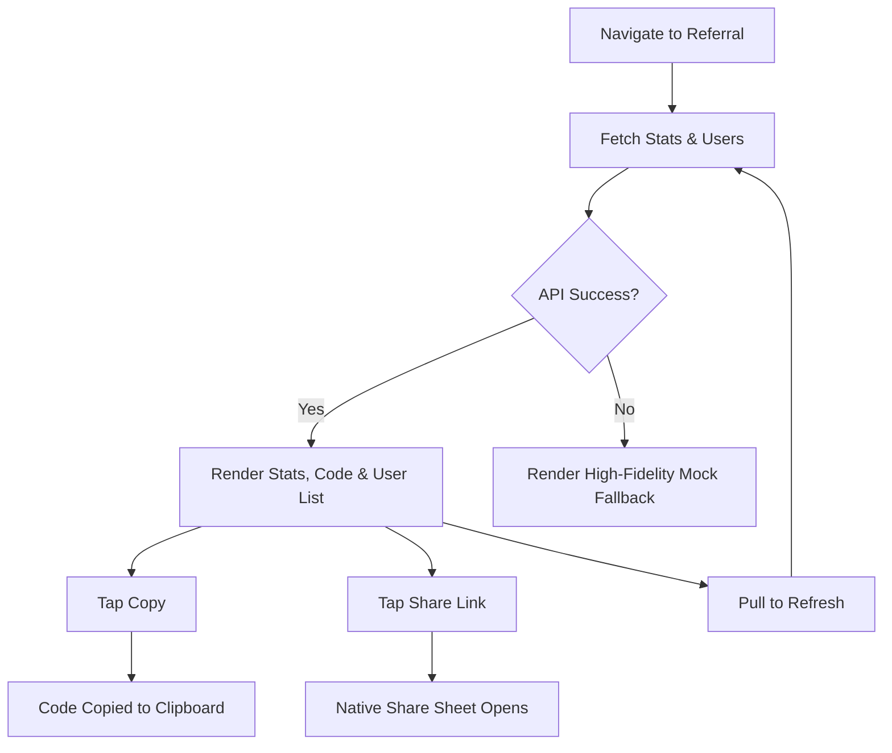

# 🎁 Referral Module QA Documentation

[⬅️ Back to Main](../README.md) | [📚 Developer Docs](../developer_docs/referral.md)

## 🗺️ User Journey Flow

---

## 🎯 Input Cheat Sheet: Correct vs Wrong

**(Note: Most referral operations are read-only or share-based. Input is handled on the referee onboarding side.)*

| Registration Link | Route Behavior | Status |
| :--- | :--- | :--- |
| `/ref/FINPE2026` | Deep links cleanly, extracts code `FINPE2026` | ✅ |
| `/referral/FINPE2026` | Alternative deep link handled | ✅ |
| `/ref/` (no code) | Handled safely, doesn't crash | ❌ |

---

## 🧪 Test Cases

### 1. Referral State & Display (Gamified Pipeline)

| Action | Expected Result |
| :--- | :--- |
| **Open Referral Screen** | Status `loading`, then `loaded` displaying "Your Earnings" (Coins Earned & Successful) prominently. |
| **View Referral Pipeline** | Shows 4-step gamified funnel: Total Referrals -> Registered -> KYC Done -> Mandate Active. "Pending" is highlighted. |
| **API Network Failure** | Soft retry happens, safely displays zeroed fallback statistics (`ReferralSummaryModel.empty`) seamlessly |
| **Pull to Refresh** | Dispatches `RefreshReferralDataEvent`, refetches silently without losing UI structure |
| **Rapid Pulls** | `restartable()` cancels stale requests |

### 2. Code & Link Sharing

| Action | Expected Result |
| :--- | :--- |
| **Tap Copy Code** | Clipboard copies the referral code, Snackbar confirms success |
| **Tap Share Link** | `ShareService` invokes native OS share sheet generating a dual-link message containing both the direct Google Play Store link (`?referrer=CODE`) and the Web/iOS fallback Universal Link. |

### 3. Referee Tracking

| Action | Expected Result |
| :--- | :--- |
| **View Referred Users List** | Displays list of partners. Shows "Verified" vs "Pending" states correctly |

### 4. Deep Linking & Installation Gap (Dual-Layer Architecture)

| Action | Expected Result |
| :--- | :--- |
| **Tap Link (App Installed)** | OS intercepts `financepe.in/ref/:code`, opens app natively (No browser), `GoRouter` saves code to session. |
| **Tap Link (Desktop Web)** | Opens `financepe.in/ref/:code` cleanly without `#` hash. Web `GoRouter` processes code. |
| **Play Store Install (Android)** | Link with `?referrer=CODE` installs app. On FIRST launch, `DeferredDeepLinkService` extracts code via Play Store API and saves it. |
| **iOS Install (Clipboard)** | Web landing page copies `FP_REF_CODE` to clipboard. App installs. On FIRST launch, app reads clipboard, extracts code, and clears clipboard. |
| **Second Launch Check** | `DeferredDeepLinkService` completely bypasses execution (reads `has_checked_deferred_referrer` flag). |
| **Referee Authentication** | The extracted referral code from Session is silently appended to both `sendOtp` and `verifyOtp` payloads during registration. |
| **Manual Referral Entry** | Tapping the animated "Have a referral code?" button on the Login Screen opens an adaptive form (BottomSheet on mobile, Dialog on desktop). Code input enforces uppercase characters. Applying a code saves it to the session and updates the animated button UI to reflect the applied code. |

---

## 🚨 Edge Cases & Boundaries

- **No Internet:** `ReferralRepository` yields `ApiFailure`. State shows `error` internally but UI falls back to offline mock statistics ensuring continuous availability.
- **Malformed Deep Links:** Missing referral codes (e.g., `/ref/`) safely fallback to generic routing without crashing. Empty API responses for the referral code fallback to a generic link to prevent null exceptions.
- **Clipboard Abuse (iOS):** If a user pastes random text into their clipboard before first launch, the `DeferredDeepLinkService` ignores it unless it strictly matches the `FP_REF_` prefix.
- **Empty API Payloads (POST /api/ref):** If backend returns empty referral links `{"referral_code": ""}`, the DataSource safely assigns an empty string instead of crashing.
