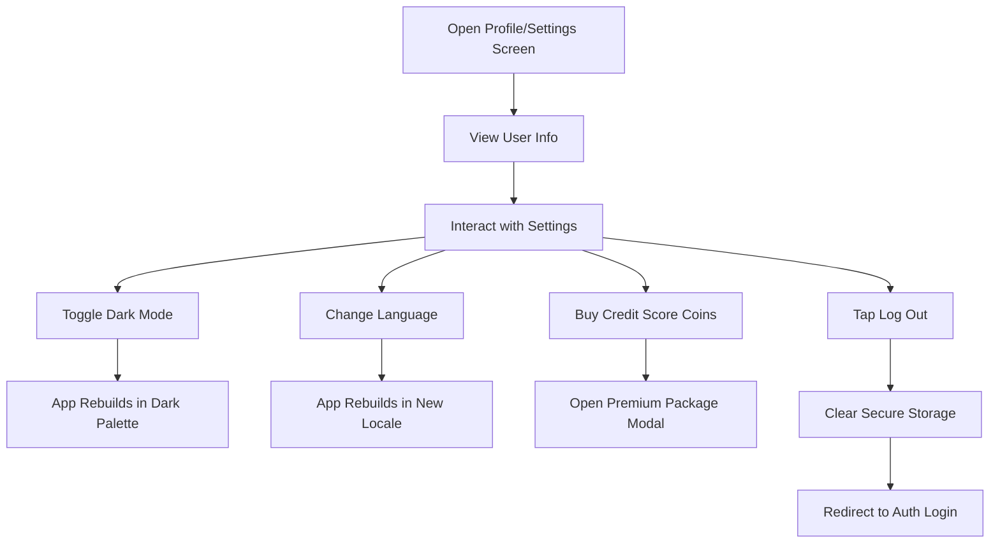

# ⚙️ Settings Module QA Documentation

[⬅️ Back to Main](../README.md) | [📚 Developer Docs](../developer_docs/settings.md)

## 🗺️ User Journey Flow

---

## 🎯 Input Cheat Sheet: Correct vs Wrong

### Buy Credit Score Coins Input
| Input String | Expected Behavior | Status |
| :--- | :--- | :--- |
| `150` | Parsed as `150`, price updates dynamically | ✅ |
| `150.5` | Keyboard restricts to digits only | ❌ |
| `abc` | DigitsOnly formatter blocks it | ❌ |
| `<empty>` | Price resets to empty, selectedAmount cleared | ✅ |

---

## 🧪 Test Cases

### 1. Profile Display
| Action | Expected Result |
| :--- | :--- |
| **View Profile Information** | Displays Name, Trade Name, Phone, Email |
| **Long Press Info** | `SelectableText` allows easy copy to clipboard |

### 2. Theme & Localization
| Action | Expected Result |
| :--- | :--- |
| **Toggle Dark Mode** | Updates SharedPreferences, instant app-wide palette switch without restart |
| **Change Language** | Updates `LocaleCubit`, text translates instantly |

### 3. Buy Credit Score Coins
| Action | Expected Result |
| :--- | :--- |
| **Open Buy Coins Modal** | Fetches packages, rates, and costs via API |
| **Select "1 Check" Package** | Input field populates with amount, UI card highlights, total amount updates |
| **Enter Custom Amount (e.g., 50)** | Package highlight clears if no exact match, dynamic price calculates `coins * rate` |

### 4. Logout Flow
| Action | Expected Result |
| :--- | :--- |
| **Tap Log Out** | Triggers `AuthService.logout()`, clears Secure Storage tokens, navigates to `/auth` |

---

## 🚨 Edge Cases & Boundaries
- **No Internet during Logout:** Local secure storage is successfully cleared anyway, ensuring user is safely logged out locally.
- **Empty Custom Coins:** Typing and deleting all text resets price and selections gracefully without `null` pointer exceptions.
- **API Failure on Coins Modal:** Loading indicator stops, gracefully handles failure to load packages.
