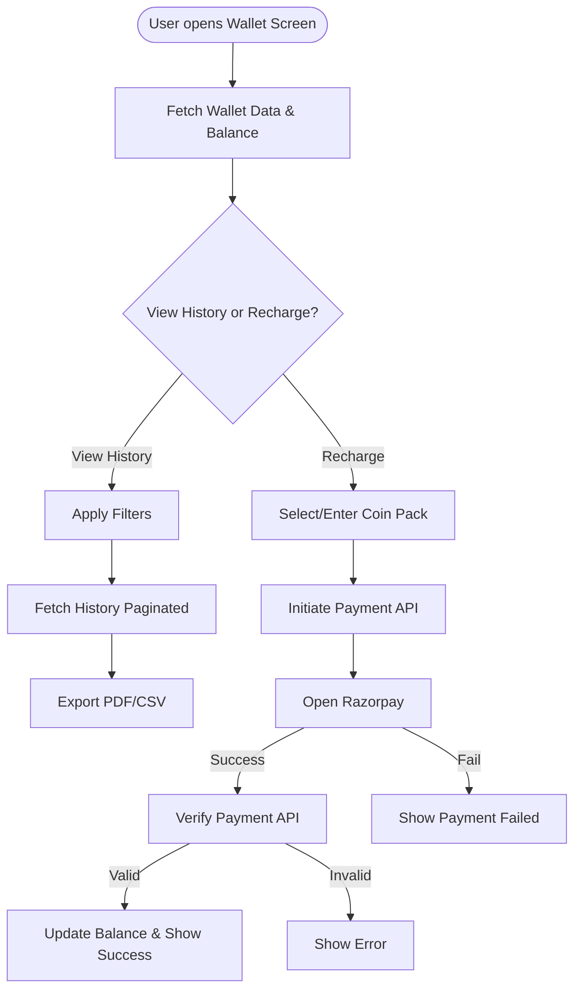

# 💰 QA Test Documentation: Wallet Module

> **[🏠 Root README](../README.md) • [💳 Mandate QA Doc](./qa_mandate.md)**

## 🌟 Overview

This document covers the **Wallet Module**, which handles merchant coin balances, transaction history (credits/debits), and the recharge/top-up flow. Coins are essential as they act as a gateway toll for creating mandates.

---

## 🗺️ User Journey Flowchart

---

## 🧪 Test Cases (Action → Expected Result)

### 1️⃣ Wallet Balance Display

| Action | Expected Result |
| :--- | :--- |
| Open Wallet screen | API fetched -> Coin balance displays correctly at the top. |
| Pull to refresh | Balance and history reload to show latest data. |

### 2️⃣ Comprehensive Filtering (Date & Transaction Type)

*Note: Filters can be stacked. E.g., Filter = "Credit" + Date = "This Month".*

| Test Case | Action | Expected Result |
| :--- | :--- | :--- |
| **Filter by Type (Credit)** | Toggle Transaction Type filter to `Credit`. | List strictly shows users with added coins. API payload: `filterType = 'credit'`. |
| **Filter by Type (Debit)** | Toggle Transaction Type filter to `Debit`. | List strictly shows users with deducted coins. API payload: `filterType = 'debit'`. |
| **Date Range: Preset (This Week)** | Toggle Date filter to `This Week`. | Results bounded from Monday to Sunday of the current week. API payload: `date_filter = 'this_week'`. |
| **Date Range: Custom (Picker)** | Select `Custom` and pick a valid start/end date range. | Results strictly constrained to selected dates. API payload sends `date_filter = 'custom'`, `from_date = 'YYYY-MM-DD'`, `to_date = 'YYYY-MM-DD'`. |
| **Stacking Filters (Multiple)** | Select `Debit` type, select `Today`. | Strict intersection applied. Only shows transactions if coins were deducted today. |
| **Clear All Filters** | Click "Clear" or "All" on filter pills. | All transactions appear again. API sends default parameters. |
| **Empty State** | Set filters resulting in 0 items. | Shows "No transactions found" illustration. |
| **Pagination** | Scroll down history list (mobile) or use pagination buttons (desktop) | Loads next page of history matching current filter criteria smoothly. |

### 3️⃣ Recharge / Top-up Flow

| Action | Expected Result |
| :--- | :--- |
| Enter a negative or zero coin amount | **Validation Error:** Blocked, must enter a valid positive coin amount. |
| Enter an amount above maximum allowed | **Validation Error:** Blocked, must be within max top-up limit. |
| Select a predefined coin pack and proceed | Initiates payment API and opens Razorpay checkout. |
| Cancel Razorpay checkout | Payment fails -> Shows "Payment Failed" -> Balance unchanged. |
| Complete Razorpay checkout successfully | Payment verified via API -> Balance updates immediately -> Success Snackbar shown. |

### 4️⃣ Coin Deduction (Mandate Creation)

| Action | Expected Result |
| :--- | :--- |
| Create a Mandate with Sufficient Coins | Coins successfully deducted, documented as a "Debit" in Wallet History. |
| Try to create Mandate with Insufficient Coins | Blocked -> Prompted to "Buy Coins" / redirected to Wallet. |

### 5️⃣ Export History

| Action | Expected Result |
| :--- | :--- |
| Click Export -> CSV | Full history downloaded as a CSV file to device. |
| Click Export -> PDF | Full history downloaded as a PDF file to device. |

---

## 🎯 Input Cheat Sheet: Correct vs Wrong

| Action/Input | ✅ Correct Input | ❌ Wrong Input |
| :--- | :--- | :--- |
| **Top-up Amount** | `500`, `1000` | `-100`, `0`, `abc` |
| **Custom Date Range** | Start: `01-Sep`, End: `10-Sep` | Start: `15-Sep`, End: `10-Sep` (Start after End) |

---

## 🛑 Edge Cases & Boundary Testing

1. **Network Disconnect during Payment:**
   - **Action:** Pay successfully on Razorpay, but internet drops before server verification.
   - **Expected:** `VerifyWalletPaymentEvent` may fail, but manual refresh later should sync balance if webhook fired on backend, OR show error message requiring support.
2. **Server Returns 500 on History Fetch:**
   - **Action:** Attempt to view wallet history when server is down.
   - **Expected:** `errorMessage` emitted -> UI shows failure state instead of empty list.
3. **Huge Export Payloads:**
   - **Action:** Export history with 5000+ items.
   - **Expected:** Loading overlay shows -> Export finishes without freezing/crashing the app.

---

## 🔄 State Transitions (For QA Reference)

State flows from `WalletBloc`:

1. `FetchWalletDataEvent` ➡️ `status: loading` ➡️ `status: success` (Balance updated)
2. `InitiateWalletPaymentEvent` ➡️ `status: paymentInitiated` ➡️ Razorpay Checkout opens
3. `VerifyWalletPaymentEvent` ➡️ `status: paymentSuccess` (Refreshes Balance) OR `status: paymentError`
4. `ApplyWalletFilterEvent` / `ApplyWalletDateFilterEvent` ➡️ `isHistoryLoading: true` ➡️ History updated
5. `ExportCoinHistoryEvent` ➡️ `status: loading` ➡️ `status: success` (File downloaded)
