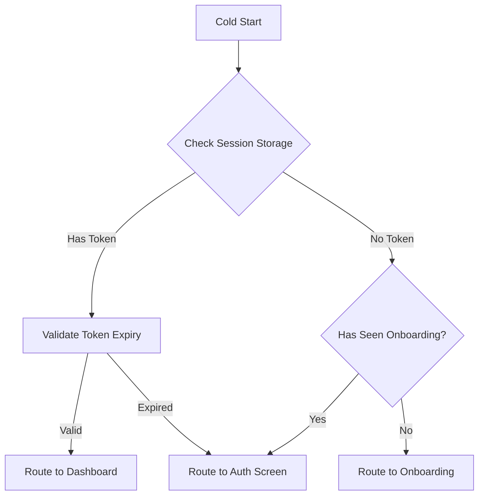
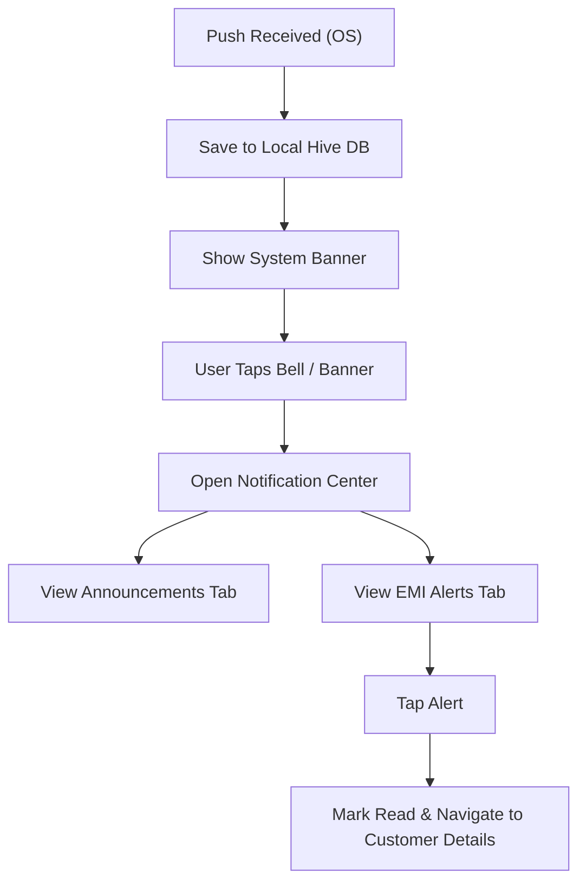

# 🚀 Release Checklist & Bootstrapping QA Documentation

[⬅️ Back to Main](../README.md) | [📚 Splash Docs](../developer_docs/splash.md) | [📚 Notification Docs](../developer_docs/notification.md)

This checklist covers application entry, authentication bootstrapping, and background push notifications.

## 🗺️ User Journey Flows

### App Launch & Bootstrapping

### Notification Delivery

---

## 🎯 Input Cheat Sheet: Correct vs Wrong

**(Note: Notification inputs are system payloads. The following focuses on local database interactions.)*

| Payload Event | Handling Behavior | Status |
| :--- | :--- | :--- |
| `emi_recovery_alert` | Saved to EMI tab, badge increments | ✅ |
| `broadcast_promo` | Saved to Announcements tab, badge increments | ✅ |
| `malformed_type` | Discarded or saved to unknown bin without crash | ✅ |

---

## 🧪 Test Cases & Release Checklist

### 1. Bootstrapping & Launch (Splash)

| Check | Action | Expected Result |
| :--- | :--- | :--- |
| [ ] | **First Install Launch** | Evaluates `has_shown_onboarding == false`, routes to `/onboarding`. |
| [ ] | **Launch without active token** | `has_shown_onboarding == true`, routes to `/auth` (Login). |
| [ ] | **Launch with active token** | Routes directly to `/home` Dashboard bypassing auth. |
| [ ] | **Desktop Window Centering** | On Windows/macOS/Linux, window centers itself and suppresses white flash on engine boot. |

### 2. Notification Center (Announcements & Alerts)

| Check | Action | Expected Result |
| :--- | :--- | :--- |
| [ ] | **Receive Background Push** | System banner appears; badge icon on Top App Bar updates automatically (stream subscription). |
| [ ] | **Open Notification Center** | Loads Annoucements (Tab 0) and EMI Alerts (Tab 1). Unread counts display accurately. |
| [ ] | **Tap EMI Alert Card** | Marks alert as read, decrements unread count, navigates to `/customer_details` for that specific mandate. |
| [ ] | **Swipe Left to Dismiss** | Removes notification card from the local Hive DB permanently. |
| [ ] | **Empty State** | Clearing all alerts renders the `NotificationEmptyStateWidget` cleanly. |
| [ ] | **Mark All as Read** | Top action button marks all items in both tabs as read, clearing all badge counters instantly. |

---

## 🚨 Edge Cases & Boundaries

- **Corrupted Storage on Boot:** `SecureStorageService` fallback protects against crashes and safely navigates the user to the Login screen if token data is malformed.
- **Lost DB Connection (Hive):** Notifications rely on local DB. If local write fails, notification may not appear in the center but the OS banner will still alert the user.
- **Empty Notifications on Boot:** Unread count stream emits `0` smoothly without `null` pointer exceptions.
